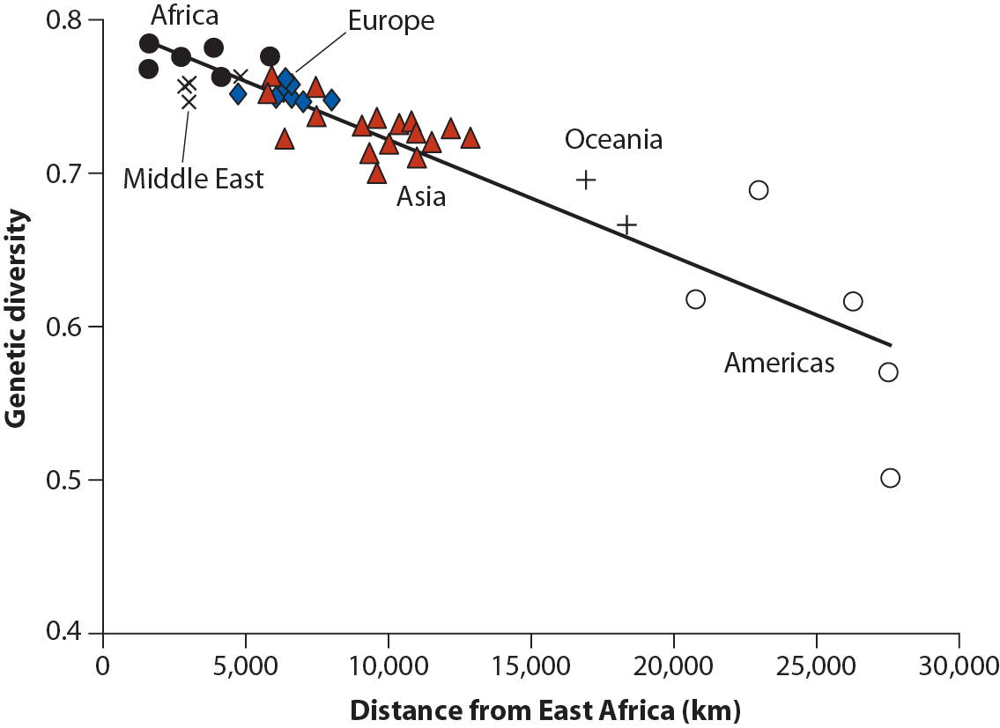

# Préambule

Ce livre contient l'ensemble du matériel (contenus, exemples, exercices...) nécessaire à la réalisation des travaux pratiques et TEA de biométrie 3. L'objectif principal de ces travaux pratiques est de vous permettre de mettre en œuvre, dans `RStudio`, les méthodes statistiques découvertes en cours magistral et en TD de biométrie 2 (au semestre précédent) et en biométrie 3 depuis début janvier.

Je considère qu'à ce stade, vous devez être à l'aise dans `RStudio` pour effectuer les tâches suivantes :

1.  Importer des jeux de données dans RStudio.
2.  Manipuler des tableaux de données avec `tidyr` [@R-tidyr] pour les mettre dans un format permettant les analyses statistiques et les représentations graphiques.
3.  Faire des graphiques exploratoires avec `ggplot2` [@R-ggplot2] pour visualiser des données.
4.  Filtrer des lignes, sélectionner des colonnes, trier, créer de nouvelles variables et calculer des résumés des données avec les fonctions `filter()`, `select()`, `arrange()`, `mutate()`, `summarise()` et `group_by()` du package `dplyr` [@R-dplyr].
5.  Utiliser le pipe `%>%` afin d'enchaîner plusieurs commandes.
6.  Créer des scripts clairs et parlants, contenant des commandes et des commentaires utiles.
7.  Spécifier/modifier votre répertoire de travail.
8.  Installer des packages additionnels.

Si vous pensez avoir besoin de rappels sur ces notions, je vous encourage vivement à consulter [le livre en ligne](https://besibo.github.io/Biometrie2/) dédié aux travaux pratiques de Biométrie 2 pour vous rafraîchir la mémoire.

L'organisation des TP et TEA de biométrie 3 sera la suivante :

-   Séance 1 : 1h30 de TP suivie d'une séance de 1h30 de TEA. Rappels concernant les statistiques descriptives et les visualisations graphiques utiles pour démêler la complexité de certains jeux de données. Comparaisons (paramétriques et non paramétriques) de la moyenne de 2 populations.
-   Séance 2 : 1h30 de TP suivie d'une séance de 1h30 de TEA. Comparaisons (paramétriques et non paramétriques) la moyenne de plus de 2 populations : analyse de variance, hypothèses et conditions d'application.
-   Séance 3 : 1h30 de TP suivie d'une séance de 1h30 de TEA. Étude de la liaison entre 2 variables. Corrélation (paramétrique et non paramétrique) et régression linéaire. Tests d'hypothèses, estimation et conditions d'application.
-   Séance 4 : 1h30 de TP. Exercices d'application et corrections en guise de préparation pour l'examen.

<!-- Les exercices seront corrigés au fur et à mesure du déroulement des séances de TP. Le corrigé des derniers exercices de la dernière séance (chapitre 5) sera mis à disposition dans un chapitre supplémentaire de ce livre en temps utile. -->

```{r setup, include=FALSE, cache=FALSE, results=FALSE, message=FALSE}
options(replace.assign = TRUE, width = 80)
options(repos = "http://cran.r-project.org/")

list.of.packages <- c("readxl", "nycflights13", "gapminder", "knitr", "tidyverse", "gridExtra", "devtools", "extrafont", "kableExtra", "skimr", "bindrcpp", "car", "DescTools", "bookdown", "datasauRus", "patchwork")
new.packages <- list.of.packages[!(list.of.packages %in% installed.packages()[,"Package"])]
if(length(new.packages)) install.packages(new.packages)

library(devtools)
library(knitr)
library(tidyverse)

# if( !("EDAWR" %in% installed.packages()[,"Package"]) ) {
#   install_github("rstudio/EDAWR")
# }

opts_chunk$set(fig.path = 'figure/', cache.path = 'cache/', tidy = FALSE,
               fig.align = 'center', out.width = '90%', fig.asp = 0.618,
               fig.show = 'hold', fig.pos = 'htpb', par = TRUE, comment = NA, cache = TRUE)
```

```{r package_bibliography, include=FALSE}
# automatically create a bib database for R packages
knitr::write_bib(c(
  .packages(), 'bookdown', 'knitr', 'rmarkdown', 'tidyverse', 'ggplot2', 'gridExtra', 'skimr', 'bindrcpp', 'tidyr', 'dplyr', 'readr', "car", "readxl", "broom", "DescTools", "patchwork"), 'packages.bib')

system("cat book.bib packages.bib > all.bib")
```


<!-- Reference a figure by its code chunk label with the `fig:` prefix, e.g., see Figure @ref(fig:nice-fig). Similarly, you can reference tables generated from `knitr::kable()`, e.g., see Table @ref(tab:nice-tab). -->

<!-- You can write citations, too. For example, we are using the **bookdown** package [@R-bookdown] in this sample book, which was built on top of R Markdown and **knitr** [@xie2015]. -->

<!--chapter:end:index.Rmd-->

# Introduction {#intro}

Sur votre disque dur, créez un dossier nommé "Biometrie3" (sans accent, sans espace).
Au début de chaque nouvelle séance de TP, vous devrez ensuite effectuer les opérations suivantes :

1. Créez, dans votre dossier "Biometrie3", un sous-dossier nommé "TP_1", "TP_2", etc.
2. Téléchargez les fichiers de données disponibles dans ce document (chapitres "Packages et données" de chaque section principale : \@ref(packages), \@ref(packages2) et \@ref(packages3)) et placez-les dans le dossier du TP correspondant.
3. Lancez RStudio.
4. Dans l'onglet "Files" de RStudio, naviguez jusqu'au sous-dossier "TP_X" que vous venez de créer et indiquez à RStudio qu'il s'agit de votre répertoire de travail. Si vous ne savez plus comment faire, consultez [la section 2.2.2](https://besibo.github.io/Biometrie2/bases.html#le-repertoire-de-travail) du livre en ligne de Biométrie 2. Si votre répertoire de travail a été correctement spécifié, vous devriez constater qu'une commande ressemblant à ceci est apparue dans la console de RStudio :
```{r, eval = FALSE}
setwd("C:/.........../Biometrie3/TP_X")
```
5. Dans la console, tapez :
```{r, eval = FALSE}
list.files()
```
La liste des fichiers contenus dans votre répertoire de travail (donc le nom des fichiers que vous avez téléchargés sur l'ENT) devrait apparaître dans la console. Si ce n'est pas le cas, recommencez depuis le début. Vous pouvez également vérifier à tout moment si le répertoire de travail utilisé par RStudio est bien celui que vous pensez en tapant :
```{r, eval = FALSE}
getwd()
```

6. Créez un nouveau script dans votre répertoire de travail et sauvegardez-le. Si vous ne savez plus comment faire, consultez [la section 2.2.3](https://besibo.github.io/Biometrie2/bases.html#les-scripts) du livre en ligne de Biométrie 2.
7. Dans l'onglet "History" de RStudio, cliquez sur la commande commençant par `setwd()` puis cliquez sur le bouton "To source" (une flèche verte dirigée vers la gauche). Cela a pour effet de copier dans votre script la commande permettant de spécifier le répertoire de travail correct. Ainsi, lors de votre prochaine session de travail, vous n'aurez pas besoin de spécifier manuellement quel est votre répertoire de travail comme nous l'avons fait à l'étape 4 ci-dessus : il vous suffira d'ouvrir votre script et d'envoyer cette commande dans la console en pressant les touches `ctrl + Entrée`.
8. N'oubliez pas de sauvegarder votre script très régulièrement et d'y ajouter autant de commentaires que nécessaire avec le symbole `#`.

Si vous suivez rigoureusement ces étapes, vous devriez être dans la situation idéale pour commencer à travailler efficacement dans RStudio. Avec un minimum d'habitude, mettre tout ça en place ne devrait pas vous demander plus de 2 ou 3 minutes. À partir de maintenant, toutes vos analyses et commentaires doivent figurer dans vos scripts.

<!--chapter:end:01-intro.Rmd-->

# Séances 1 et 2 : statistiques descriptives et tests d'hypothèses {#seance1}


## Packages et données {#packages}

Pour chacune des 4 séances de travaux pratiques (et TEA) qui viennent, vous aurez besoin d'utiliser des packages spécifiques et d'importer des données depuis des fichiers externes disponibles sur l'ENT (ou directement depuis ce document).

Les packages dont vous aurez besoin pour cette séance, et que vous devez donc charger en mémoire, sont les packages du `tidyverse` [@R-tidyverse], qui permettent de manipuler facilement des tableaux de données et de réaliser des graphiques, le package `readr` [@R-readr], pour importer facilement des fichiers `.csv` au format `tibble`, le package `readxl` [@R-readxl], pour importer facilement des fichiers Excel au format `tibble`, le package `skimr` [@R-skimr], qui permet de calculer des résumés de données très informatifs, et le package `car` [@R-car], qui permet d'effectuer le test de comparaison des variances de Levene :
```{r, warning=FALSE, message=FALSE}
library(tidyverse)
library(readr)
library(readxl)
library(skimr)
library(car)
```

Si ces commandes (que vous devez taper dans vos scripts avant de les exécuter dans la console de RStudio) renvoient des messages d'erreur, c'est que les packages que vous essayez de charger en mémoire ne sont pas installés sur votre ordinateur. Il vous faudra alors installer les packages manquants avec la fonction :
```{r, eval = FALSE}
install.packages("nom_du_package")
```
Comme d'habitude, si tout ça est un peu flou pour vous, relisez [la section 2.3](https://besibo.github.io/Biometrie2/bases.html#charger-un-package-en-memoire) du livre de biométrie 2 disponible en ligne.


Vous aurez également besoin des jeux de données suivants :

- [`Autruches.csv`](data/Autruches.csv)
- [`HommesFemmes.xls`](data/HommesFemmes.xls)
- [`HornedLizards.csv`](data/HornedLizards.csv)
- [`Temperature.csv`](data/Temperature.csv)
- [`Temperature2.csv`](data/Temperature2.csv)
- [`Testosterone.csv`](data/Testosterone.csv)


## Comparaison de la moyenne d'une population à une valeur théorique

### Exploration préalable des données{#Explo}

Avant de se lancer dans les tests d'hypothèses, il est **toujours indispensable** d'examiner les données dont on dispose à l'aide, d'une part de statistiques descriptives numériques, et d'autres part, de graphiques exploratoires. Nous allons voir dans cette section quels indices statistiques il peut être utile de calculer et quelles représentations graphiques il peut être utile de réaliser afin de pouvoir se lancer dans des tests d'hypothèses sans risquer de grossières erreurs.


#### Importation et examen visuel

Commencez par importer les données contenues dans [le fichier `Temperature.csv`](data/Temperature.csv). Pour cela, utilisez l'assistant d'importation de RStudio. Si vous ne savez plus comment faire, consultez [la section 5.3](https://besibo.github.io/Biometrie2/tidyr.html#importer-des-donnees-depuis-un-tableur) du livre en ligne de Biométrie 2.

```{r, echo = FALSE, message = FALSE}
Temperature <- read_csv("data/Temperature.csv")
```

Vous stockerez les données dans un objet que vous nommerez `Temperature`. Après l'importation, taper son nom dans la console de RStudio doit produire le résultat suivant :

```{r}
Temperature
```

Ce tableau contient les températures corporelles de 25 adultes en bonne santé choisis au hasard parmi la population américaine. On souhaite examiner la croyance populaire indiquant que la température moyenne d'adultes en bonne santé vaut 37ºC.

La première chose à faire quand on travaille avec des données inconnues, c'est d'examiner les données brutes. Ici, les données sont importées au format `tibble`, donc seules les premières lignes sont visibles. Pour visualiser l'ensemble du tableau, utilisez la fonction `View()` :

```{r, eval = FALSE}
View(Temperature)
```

Cette commande doit ouvrir un nouvel onglet présentant les données dans un tableur simplifié, en lecture seule.

On constate ici 2 choses que nous allons modifier :

1. la première colonne, intitulée `individual`, n'est pas véritablement une variable. Cette colonne ne contient qu'un identifiant qui est en fait identique au numéro de ligne. Nous allons donc supprimer cette colonne
2. les températures sont exprimées en degrés Fahrenheit, ce qui rend leur lecture difficile pour nous qui sommes habitués à utiliser le système métrique et les degrés Celsius. Nous allons donc convertir les températures en degrés Celsius grâce à la formule suivante : 

$$ºC = \frac{ºF - 32}{1.8}$$

```{r}
Temp_clean <- Temperature %>% 
  select(-individual) %>%      # Suppression de la première colonne
  mutate(                      # Transformation des températures en Celsius
    temperature = (temperature - 32) / 1.8
    )

Temp_clean
```

Il nous est maintenant possible d'examiner à nouveau les données avec la fonction `View()`. Avec des valeurs de températures comprises entre 36.3 ºC et 37.8 ºC, il n'y a visiblement pas de données aberrantes. 

C'est toujours la première chose à faire : regarder les données brutes pour repérer :

- La nature des variables présentes.
- Les variables inutiles qui pourront être supprimées ou négligées.
- Les unités des variables utiles, afin de pouvoir les convertir si nécessaire.
- Les valeurs manquantes ou aberrantes qui demanderont toujours une attention particulière.

Une fois l'examen préliminaire des données réalisé, on peut passer au calcul des statistiques descriptives.

#### Statistiques descriptives

On s'intéresse ici au calcul de grandeurs statistiques nous apportant des renseignements sur la distribution des valeurs de l'échantillon. Les questions auxquelles on tente de répondre à ce stade sont les suivantes :

- Quelle est la tendance moyenne ?
- Quelle est la dispersion des données autour de la moyenne ?

Pour répondre à ces questions, on peut faire appel à de multiples fonctions. J'en évoquerai ici seulement 3 qui permettent d'obtenir la plupart des informations dont nous avons besoin très simplement :

```{r}
summary(Temp_clean)
```

Comme son nom l'indique, la fonction `summary()` renvoie un résumé des données :

- les valeurs extrêmes (minimum et maximum)
- les valeurs "centrales" (moyenne et médiane)
- les valeurs des quartiles (premier et troisième quartiles)

Ces valeurs seront presques toutes reprises sur le graphique de type "boîte à moustaches" que nous verrons plus bas.

On constate ici que la moyenne et la médiane sont très proches. La distribution des températures doit donc être à peut près symmétrique, avec à peu près autant de valeurs au-dessus que de valeurs en dessous de la moyenne.

La seconde fonction utile est la fonction `IQR()`, comme "Inter Quartile Range" (ou intervalle inter-quartile). Cette fonction renvoie l'étendue de l'intervalle inter-quartile, c'est à dire la valeur du troisième quartile moins la valeur de premier quartile. Attention, cette fonction a besoin d'un vecteur en guise d'argument, or nos données sont stockées sous forme de `tibble`. Nous allons donc utiliser la fonction `pull()` du package `dplyr` afin de transformer (momentanément) la colonne `temperature` du tableau `Temp_clean` en vecteur :

```{r}
Temp_clean %>% 
  pull(temperature) %>% 
  IQR()
```
 On constate ici que l'intervalle inter quartile a une largeur de 0.55 degrés Celsius. Cela signifie que les 50% des températures les plus centrales sont situées dans un intervalle d'environ un demi-degré celsius.

Enfin, une autre façon d'obtenir des informations rapidement consiste à utiliser la fonction `skim()` du package `skimr` :

```{r,  render = knitr::normal_print, size = 'small'}
skim(Temp_clean)
```

Tout comme `summary()`, la fonction `skim()` renvoie les valeurs minimales et maximales, les premiers et troisièmes quartiles ainsi que la moyenne et la médiane. Elle nous indique en outre la valeur de l'écart-type de l'échantillon, ainsi que le nombre d'observations et le nombre de données manquantes. Enfin, elle fournit un histogramme très schématique et sans échelle. Cet histogramme nous permet de nous faire une première idée de la distribution des données.


Outre ces 3 fonctions (`summary()`, `IQR()`, et `skim()`), il est bien sûr possible de calculer toutes ces valeurs manuellement si besoin :

- `mean()` permet de calculer la moyenne.
- `median()` permet de calculer la médiane.
- `min()` et `max()` permettent de calculer les valeurs minimales et maximales respectivement.
- `quantile()` permet de calculer les quartiles.
- `sd()` permet de calculer l'écart-type.
- `var()` permet de calculer la variance.

Toutes ces fonctions prennent seulement un vecteur en guise d'argument. Il faut donc procéder comme avec `IQR()` pour les utiliser. Par exemple, pour calculer la variance, on peut taper :

```{r}
Temp_clean %>% 
  pull(temperature) %>% 
  var()
```

ou :

```{r}
var(Temp_clean$temperature)
```


#### Exploration graphique

Ici, il s'agit d'examiner la distribution des données. Pour cela, 3 types de graphiques sont généralement utilisés.

1. Les nuages de points ou stripcharts :

```{r, fig.asp = 1.5, out.width = '25%', fig.width = 2}
Temp_clean %>% 
  ggplot(aes(x = 1, y = temperature)) +
  geom_point()
```

Dans la mesure où souvent, plusieurs observations ont la même valeur, il faut tenir compte de l'over-plotting. Si vous ne vous rappelez plus de quoi il s'agit, consultez [la section 4.3.4](https://besibo.github.io/DA/viz.html#over-plotting) du livre en ligne de Biométrie 2. Globalement, pour visualiser correctement les données, on va jouer soit sur la transparence des points, soit sur l'ajout d'un bruit aléatoire horizontal qui permettra de distinguer plus facilement les points et de repérer les zones où les points sont abondants ou rares :

```{r, fig.asp = 1.5, out.width = '25%', fig.width = 2}
Temp_clean %>% 
  ggplot(aes(x = 1, y = temperature)) +
  geom_jitter(height = 0, width = 0.1) +
  xlim(0.5, 1.5)
```

La fonction `xlim()` permet de spécifier manuellement les valeurs limites que l'on souhaite pour l'axe des abscisses. Ici, cet axe n'a aucune signification particulière puisque nous n'avons qu'une unique série de données (c'est la raison pour laquelle les points sont centrés sur l'abscisse x = 1). Nous pouvons donc le masquer comme ceci :

```{r, fig.asp = 1.5, out.width = '25%', fig.width = 2}
Temp_clean %>% 
  ggplot(aes(x = 1, y = temperature)) +
  geom_jitter(height = 0, width = 0.1) +
  xlim(0.5, 1.5) +
  theme(axis.text.x = element_blank(),
        axis.ticks.x = element_blank(),
        axis.title.x = element_blank())
```

On constate ici que la répartition des points est assez régulière, avec néanmoins une majorité de points entre 36.8 et 37.3 degrés Celsius.

2. L'histogramme :

```{r}
Temp_clean %>% 
  ggplot(aes(x = temperature)) +
  geom_histogram(bins = 10, color = grey(0.8))
```

Si vous ne vous rappelez-plus ce qu'est un histogramme ou comment le faire, ou la signification de l'argument `bins`, relisez [la section 4.5](https://besibo.github.io/DA/viz.html#histogram) du livre en ligne de Biométrie 2.

Notez ici que la forme de cet histogramme est relativement proche de celle présentée plus tôt par la fonction `skim()`. Cet histogramme nous apprend qu'en dehors d'un "trou" autour de la température 36.75 ºC, la distribution des données est proche d'une courbe en cloche. Il y a fort à parier qu'un test de normalité concluerait à la normalité des données de cet échantillon.

3. Les boîtes à moustaches :

```{r, fig.asp = 1.5, out.width = '25%', fig.width = 2}
Temp_clean %>% 
  ggplot(aes(y = temperature)) +
  geom_boxplot(notch = TRUE)
```

Comme pour le stripchart présenté plus haut, l'axe des abscisses n'a ici aucun sens. Nous n'avons qu'une unique série de données, l'axe des `x` est donc inutile et nous pouvons donc le retirer :

```{r, fig.asp = 1.5, out.width = '25%', fig.width = 2}
Temp_clean %>% 
  ggplot(aes(y = temperature)) +
  geom_boxplot(notch = TRUE) +
  theme(axis.text.x = element_blank(),
        axis.ticks.x = element_blank())
```

On retrouve sur ce graphique tous les éléments obtenus avec la fonction `summary()` à l'exception de la moyenne. Assurez-vous que vous êtes bien capables d'identifier tous ces éléments sur le graphique. Assurez-vous aussi que la signification de l'encoche (obtenue avec l'argument `notch = TRUE`) est bien claire pour vous. Comme toujours, si ce n'est pas le cas, consultez [la section dédiée aux boxplots](https://besibo.github.io/DA/viz.html#les-boites-a-moustaches-ou-boxplots) dans le livre en ligne de Biométrie 2.


Pour conclure, ces 3 types de représentations graphiques (nuages de points ou stripchart, histogrammes et boxplots) sont complémentaires. Ces trois types de représentations graphiques permettent de visualiser la distribution d'une variable numérique. Les nuages de points permettent de voir toutes les données brutes. Les histogrammes résument les données en quelques valeurs : une valeur d'abondance pour chaque barre ou classe. Les boxplots résument encore plus les données avec seulement 7 valeurs qui caractérisent la distribution (voir figure \@ref(fig:compdistr) ci-dessous).

```{r compdistr, warning = FALSE, message = FALSE, echo=FALSE, fig.cap="Comparaison de 2 types de représentations graphiques"}
library(patchwork)

pl1 <- Temp_clean %>% 
  ggplot(aes(y = temperature)) +
    geom_histogram(bins = 10) +
    expand_limits(y = c(36.25, 37.8))

pl2 <- Temp_clean %>% 
  ggplot(aes(y = temperature)) +
    geom_boxplot(notch = TRUE) +
    expand_limits(y = c(36.08, 37.8)) +
    theme(axis.text.x = element_blank(),
          axis.ticks.x = element_blank())

pl3 <- Temp_clean %>% 
  ggplot(aes(x = 1, y = temperature)) +
    geom_jitter(width = 0.2, height = 0) +
    expand_limits(y = c(36.08, 37.8)) +
    xlim(0.5, 1.5) +
    theme(axis.text.x = element_blank(),
          axis.ticks.x = element_blank(),
          axis.title.x = element_blank())

pl3+pl1+pl2
```

À chaque nouvelle analyse statistique, il sera donc important de visualiser les données afin de repérer les éventuels problèmes et afin d'anticiper sur les résultats que fourniront les tests d'hypothèses ultérieurs. Ici, l'examen de ces graphiques nous permet de dire les choses suivantes :

1. Il n'y a visiblement pas de données aberrantes.
2. La distribution des données semble suivre à peu près la loi Normale.
3. La médiane et son intervalle de confiance à 95% sont centrés sur la valeur 37ºC. Un test devrait donc arriver à la conclusion que la température corporelle des adultes n'est pas significativement différente de 37ºC. Néanmoins, la largeur de l'intervalle de confiance à 95% est assez grande, ce qui indique une incertitude relativement élevée. Une plus grande quantité de données permettrait certainement d'obtenir plus de précision.


### Le test paramétrique

Le test permettant de comparer la moyenne d'une population à une valeur théorique, fixée par l'utilisateur, est le **test de Student à un échantillon**. Il s'agit d'un test paramétrique très puissant. Comme tous les tests paramétriques, certaines conditions d'application doivent être vérifiées avant de pouvoir l'appliquer.

#### Conditions d'application

Les conditions d'application du test de Student à un échantillon sont les suivantes : 

1. Les données de l'échantillon sont issues d'un **échantillonnage aléatoire** au sein de la population générale. Cette condition est partagée par toutes les méthodes que nous verrons dans ces TP. En l'absence d'informations sur la façon dont l'échantillonnage a été réalisé, on considère que cette condition est remplie. Il n'y a pas de moyen statistique de le vérifier, cela fait uniquement référence à la stratégie d'échantillonnage et à la rigueur de la procédure mise en œuvre lors de l'acquisition des données.
2. La variable étudiée doit suivre une **distribution Normale** dans la population générale. Nous allons vérifier cette condition d'application avec un test de normalité de Shapiro-Wilk.

Comme pour tous les tests statistiques que nous allons réaliser lors de ces séances de TP et TEA, nous devons commencer par spécifier les hypothèses nulles et alternatives ainsi que la valeur du seuil $\alpha$ que nous allons utiliser. Ici, nous utiliserons toujours le seuil $\alpha = 0.05$.

Pour un test de normalité, les hypothèses sont toujours les suivantes :

- H$_0$ : la variable étudiée suit une distribution Normale dans la population générale.
- H$_1$ : la variable étudiée ne suit pas une distribution Normale dans la population générale.

Le test de Shapiro-Wilk se réalise de la façon suivante :

```{r}
Temp_clean %>% 
  pull(temperature) %>% 
  shapiro.test()
```

`W` est la statistique du test. Elle permet à RStudio de calculer la *p*-value du test. Ici, $p > \alpha$. On ne peut donc pas rejeter l'hypothèse nulle de normalité : on ne peut pas exclure que dans la population générale, la température suive bel et bien une distribution Normale. Les conditions d'application du test de Student sont bien vérifiées.


#### Réalisation du test et interprétation

Puisque les conditions d'application du test de Student à un échantillon sont vérifiées, nous devons maintenant spécifier les hypothèses nulles et alternatives que nous allons utiliser pour réaliser ce test :

- H$_0$ : dans la population générale, la température corporelle moyenne des adultes en bonne santé vaut 37ºC ($\mu = 37$).
- H$_1$ : dans la population générale, la température corporelle moyenne des adultes en bonne santé est différente de 37ºC ($\mu \neq 37$).

On réalise ensuite le test de la façon suivante :

```{r}
Temp_clean %>% 
  pull(temperature) %>% 
  t.test(mu = 37)
```

Sur la première ligne, R nous confirme que nous avons bien réalisé un test de Student à un échantillon. La première ligne de résultats fournit la valeur du $t$ calculé (ici, -0.56), le nombre de degrés de libertés (ici, `df` = 24), et la $p$-value (ici, 0.58, soit une valeur supérieure à $\alpha$). Cette première ligne contient donc tous les résultats du test qu'il conviendrait de rappeler dans un rapport. On devrait ainsi dire : 

> Au seuil $\alpha$ de 5%, on ne peut pas rejeter l'hypothèse nulle $\mu = 37$ ($t = -0.56$, ddl = 24, $p = 0.58$). Les données observées sont donc compatibles avec l'hypothèse selon laquelle la température corporelle moyenne des adultes en bonne santé vaut 37ºC.

C'est de cette manière que vous devriez rapporter les resultats de ce test dans vos comptes-rendus et rapports à partir de maintenant.

Dans les résultats du test, la ligne suivante (`alternative hypothesis: ...`) **ne donne pas la conclusion du test**. Il s'agit simplement d'un rappel concernant l'hypothèse alternative qui a été utilisée pour réaliser le test. Ici, l'hypothèse alternative utilisée est une hypothèse bilatérale ($\mu \neq 37$). Nous verrons plus tard comment spécifier des hypothèses alternatives uni-latérales, même si la plupart du temps, mieux vaut s'abstenir de réaliser de tels tests (à moins bien sûr d'avoir une bonne raison de le faire).

Les résultats fournis ensuite concernent, non plus le test statistique à proprement parler, mais l'estimation. Ici, la moyenne de l'échantillon est fournie. Il s'agit de la meilleure estimation possible de la moyenne de la population : $\bar{x} = \hat{\mu} = 36.96$. Comme pour toutes les estimations, cette valeur est entachée d'incertitude liée à la fluctuation d'échantillonnage. L'intervalle de confiance à 95% de cette estimation de moyenne est donc également fourni : $[36.80 ; 37.11]$. Autrement dit, cet intervalle contient les valeurs les plus vraissemblables pour la véritable valeur de moyenne dans la population générale. Cela confirme bien que nous n'avons pas prouvé au sens strict que la moyenne de la population vaut 37ºC. Nous avons en réalité montré que nous ne pouvions pas exclure que la moyenne de la population générale soit de 37ºC. Cette valeur est en effet comprise dans l'intervalle de confiance. On ne peut donc pas l'exclure : nos données sont compatibles avec cette hypothèse. Mais beaucoup d'autres valeurs figurent aussi dans cet intervalle. Il est donc tout à fait possible que la moyenne soit en réalité différente de 37ºC. Pour en être sûr, il faudrait probablement un échantillon de plus grande taille afin de limiter l'incertitude.

### L'alternative non paramétrique

Si jamais les conditions d'application du test de Student à un échantillon n'étaient pas remplies, il faudrait alors réaliser son équivalent non paramétrique : le **test de Wilcoxon des rangs signés**. Ce test est moins puissant que son homologue paramétrique. On ne l'effectue donc que lorsque l'on n'a pas le choix :

```{r}
Temp_clean %>% 
  pull(temperature) %>% 
  wilcox.test(mu = 37, conf.int = TRUE)
```

La syntaxe est identique à celle du test de Student à un échantillon à une exception près : l'ajout de l'argument `conf.int = TRUE` qui permet d'afficher la (pseudo)médiane de l'échantillon et son intervalle de confiance à 95%.

Les hypothèses nulles et alternatives de ce test sont les mêmes que celles du test de Student à un échantillon. En toute rigueur, on teste l'égalité de la médiane à une valeur théorique, et non l'égalité de la moyenne. Mais dans la pratique, la grande majorité des utilisateurs de ce test font l'amalgame entre moyenne et médiane. Ici, la conclusion correcte devrait être :

> Au seuil $\alpha$ de 5%, on ne peut pas rejeter l'hypothèse nulle (test de Wilcoxon des rangs signés, $V$ = 143, $p$ = 0.6077). La médiane de la population ($\widehat{med}$ = 36.94) n'est pas significativement différente de 37ºC (IC 95% : $[36.78 ; 37.11]$).

Si les données ne suivent pas la loi Normale, la médiane est bien la métrique la plus intéressante puisque c'est elle qui nous renseigne sur la tendance centrale des données.

Enfin, les tests de Wilcoxon renvoient souvent des messages d'avretissement. Il ne s'agit que de ça : des avertissements. Tant que la $p$-value des tests est éloignée de la valeur seuil $\alpha$, cela n'a pas d'importance. Quand en revanche la $p$-value est très proche de $\alpha$, il faut être très prudent face aux conclusions du test qui peuvent alors être assez "fragiles".

(Notez que pour le test de Student à un échantillon comme pour le test de Wilcoxon des rangs signés, les conclusions sont en accord avec nos observations initiales réalisées à partir du boxplot).


### Exercice d'application

[Le fichier `Temperature2.csv`](data/Temperature2.csv) contient les données brutes d'une seconde étude similaire, réalisée à plus grande échelle. Importez ces données et analysez-les afin de vérifier si la température corporelle moyenne des adultes en bonne santé vaut bien 37ºC. Comme toujours, avant de vous lancer dans la réalisation des tests statistiques, prenez le temps d'examiner vos données comme nous l'avons décrit dans la section \@ref(Explo), afin de savoir où vous allez, et de repérer les éventuelles données manquantes ou aberrantes.


## Comparaison de la moyenne de 2 populations : données appariées

On s'intéresse ici à la comparaison de 2 séries de données dont les observations sont liées 2 à 2. C'est par exemple le cas lorsque l'on fait subir un traitement à différents sujets et que l'on souhaite comparer les mesures obtenues avant et après le traitement. 

Autrement dit, dans les plans d'expériences appariés, **les deux traitements** ou modalités **sont appliqués à chaque unité d'échantillonnage**.

Voici quelques exemples de situations qui devraient être traitées avec des tests sur données appariées :

- Comparaison de la masse de patients avant et après une hospitalisation.
- Comparaison de la diversité de peuplements de poissons dans des lacs avant et après contamination par des métaux lourds.
- Test des effets d'une crème solaire appliquée sur un bras de chaque volontaire alors que l'autre bras ne reçoit qu'un placébo.
- Test des effets du tabagisme dans un échantillon de fumeurs, dont chaque membre est comparé à un non fumeur choisi pour qu'il lui ressemble le plus possible en terme d'âge, de masse, d'origine éthnique et sociale, etc.
- Test des effets que les conditions socio-économiques ont sur les préférences alimentaires en comparant des vrais jumaux élevés dans des familles adoptives séparées qui diffèrent en termes de conditions socio-économiques.

Les 2 derniers exemples montrent que même des individus séparés peuvent constituer une  "paire statistique" s'ils partagent un certain nombre de caractéristiques (physiques, environnementales, génétiques, comportementales, etc.) pertinentes pour l'étude.

### Exploration préalable des données{#Explo2}

Ici, nous allons nous intéresser au lien qui pourrait exister entre la production de testostérone et l'immunité chez une espèce d'oiseau vivant en Amérique du Nord, [le carouge à épaulettes](https://fr.wikipedia.org/wiki/Carouge_à_épaulettes).

Chez de nombreuses espèces, les mâles ont plus de chances d'attirer des femelles s'ils produisent des niveaux de testostérone élevés. Est-ce que la forte production de testostérone de certains mâles a un coût, notamment en terme d'immuno-compétence ? Autrement dit, est-ce que produire beaucoup de testostérone au moment de la reproduction (ce qui fournit un avantage sélectif) se traduit par une immunité plus faible par la suite, et donc une plus forte susceptibilité de contracter des maladies (ce qui constitue donc un désavantage sélectif) ?

Pour étudier cette question, une équipe de chercheurs [@Hasselquist1999] a mis en place le dispositif expérimental suivant. Les niveaux de testostérone de 13 carouges à épaulettes mâles ont été artificiellement augmentés par l'implantation chirurgicale d'un microtube perméable contenant de la testostérone. L'immunocompétence a été mesurée pour chaque oiseau avant et après l'opération chirurgicale. La variable mesurée est la production d'anticorps suite à l'exposition des oiseaux avec un antigène non pathogène mais censé déclencher une réponse immunitaire. Les taux de production d'anticorps sont exprimés en logarithmes de densité optique par minute $\left(\ln\frac{mOD}{min}\right)$.

#### Importation et examen visuel

Les données se trouvent dans  [le fichier `Testosterone.csv`](data/Testosterone.csv). Importez ces données dans un objet nommé `Testo` et examinez le tableau obtenu.

```{r, echo = FALSE, message=FALSE}
Testo <- read_csv("data/Testosterone.csv")
```

```{r}
Testo
```

Visiblement, il n'y a pas de données manquantes mais certaines variables sont inutiles. En réalité, nous aurons besoin des données sous 2 formats disctincts : un format "large" pour les statistiques descriptives et les tests d'hypothèses, et un format "long" pour les représentations graphiques. Et dans tous les cas, l'identifiant individuel devrait être considéré comme un facteur, et non comme une variable numérique comme c'est le cas actuellement.

Commençons par créer un tableau "large" pour les statistiques descriptives :

```{r}
Testo_large <- Testo %>% 
  mutate(blackbird = factor(blackbird)) %>%
  select(ID = blackbird,
         Before = logBeforeImplant,
         After = logAfterImplant)

Testo_large
```

Il nous faut maintenant transformer ce tableau en format "long" pour les représentations graphiques :

```{r}
Testo_long <- Testo_large %>% 
  pivot_longer(cols = c(Before, After),
               names_to = "Traitement", 
               values_to = "DO") %>% 
  mutate(Traitement = factor(Traitement, levels = c("Before", "After")))

Testo_long
```

Si vous ne comprenez pas ces commandes, je vous conseille vivement de reprendre [les chapitres 5 et 6](https://besibo.github.io/DA/tidyr.html) du livre en ligne de Biométrie 2. Dans l'idéal, depuis les TP de biométrie 2, vous devriez être capables de construire de telles séquences de commandes pour aboutir à un tableau rangé ne contenant que les variables utiles, au format long comme au format court (ou large). Mais évidemment, de tels groupes de commandes se construisent étape par étape, et pas d'un seul coup, contrairement à ce que les commandes précédentes pourraient laisser croire.

Maintenant que nous disposons de ces 2 tableaux, nous pouvons commencer à décrire nos données.


#### Statistiques descriptives

Pour décrire simplement les données, nous nous en tiendront ici à l'utilisation des fonctions `summary()` et `skim()`.

Pour la fonction `summary()`, le plus simple est toujours d'utiliser le tableau au format large :

```{r}
summary(Testo_large)
```

On constate ici que pour les 2 traitements, les valeurs des différents indices sont très proches entre les 2 séries de données, avec des valeurs de densité optiques (DO) légèrement supérieures après l'opération chirurgicale (sauf pour le premier quartile).

Pour la fonction `skim()` le plus simple est là aussi d'utiliser le tableau large :

```{r,  render = knitr::normal_print, size = 'small'}
skim(Testo_large)
```

On arrive toutefois aux mêmes résultats avec le tableau long, à condition de grouper les données par traitement (variable `Traitement`) avec `group_by()` :

```{r, render = knitr::normal_print, size = 'small'}
Testo_long %>% 
  group_by(Traitement) %>% 
  skim()
```


#### Exploration graphique

Ici, c'est le tableau rangé au format long qui sera le plus adapté. Lorsque nous avions une unique série de données, nous avons utilisé 3 types de représentations graphiques pour visualiser les données. Nous allons là aussi réaliser ces 3 graphiques. Toutefois, puisque nous avons maintenant plusieurs séries de données, le format des graphiques sera légèrement différent.

1. Données brutes sous forme de nuage de points (ou de stripchart) :

```{r, fig.asp = 1.5, out.width = '25%', fig.width = 2}
Testo_long %>% 
  ggplot(aes(x = Traitement, y = DO)) +
  geom_point()
```

Comme toujours, on peut réaliser un stripchart pour limiter les problèmes d'over-plotting :

```{r, fig.asp = 1.5, out.width = '25%', fig.width = 2}
Testo_long %>% 
  ggplot(aes(x = Traitement, y = DO)) +
  geom_jitter(height = 0, width = 0.25)
```

2. Histogrammes

Nous allons faire un histogramme pour chaque série de données en utilisant des facettes :
```{r}
Testo_long %>% 
  ggplot(aes(x = DO)) +
  geom_histogram(bins = 10, color = grey(0.8))+
  facet_wrap(~Traitement, ncol = 1)
```

3. Boxplots

```{r, fig.asp = 1.5, out.width = '25%', fig.width = 2}
Testo_long %>% 
  ggplot(aes(x = Traitement, y = DO)) +
  geom_boxplot(notch = TRUE)
```

Ici, l'intervalle de confiance à 95% de la médiane pour la série "After" est tellement large que son extrémité supérieure dépasse la valeur du troisième quartile, la valeur maximale observée, et la limite supérieure de l'axe des ordonnées. Il vaut donc mieux ne pas faire figurer les encoches pour avoir un graphique plus présentable :

```{r, fig.asp = 1.5, out.width = '25%', fig.width = 2}
Testo_long %>% 
  ggplot(aes(x = Traitement, y = DO)) +
  geom_boxplot()
```

À première vue, ces 3 représentations graphiques semblent montrer que la seconde série de données (après l'opération chirurgicale) présente des valeurs légèrement plus élevées que la première (avant l'opération). Toutefois, il semble que la dispersion des données soit aussi plus importante après l'opération qu'avant, sauf pour un individu outlier qui présente une immuno-compétence très faible avant l'opération.

Toutes ces représentations graphiques sont certes utiles, mais elles masquent un élément crucial : ce sont les mêmes individus qui sont étudiés avant et après l'opération. Il s'agit de données appariées ! Pour avoir une bonne vision de ce qui se passe, il nous faut faire apparaître ce lien entre les 2 séries de données :

```{r, fig.asp = 1.5, out.width = '33%', fig.width = 3}
Testo_long %>% 
  ggplot(aes(x = Traitement, y = DO, group = ID, color = ID)) +
  geom_line() +
  geom_point(alpha = 0.7)
```

Ce graphique nous donne une image très différente de la réalité des données. On constate ici que l'immuno-compétence de certains individus augmente, alors que pour d'autres, elle diminue. 

Une façon d'estimer si les changements d'immuno-compétence sont majoritairement orientés dans un sens ou non est de calculer l'intervalle de confiance à 95% de la différence d'immuno-compétence entre avant et après l'opération.

### Le test paramétrique

Le test paramétrique permettant de comparer la moyenne sur des séries appariées est là encore un test de Student : le **test de Student sur données appariées** (étonnant non ?...). En réalité, ce test de Student n'est pas un test de comparaison de moyennes à proprement parler. La procédure est en fait la suivante :

1. Pour chaque individu, calculer la différence d'immuno-compétence entre les deux temps de l'expérience (DO après - DO avant)
2. Puisque nous avons 13 individus, nous aurons 13 valeurs de différences. La moyenne de cette différence sera comparée à la valeur théorique 0. Autrement dit, si les 2 séries ont même moyenne, la moyenne des différences doit être nulle. Sinon, la moyenne des différences doit être différente de zéro.

#### Conditions d'application

Les conditions d'application de ce test paramétrique sont presque les mêmes que pour le test de Student à un échantillon :

1. Les individus sur lesquels portent la comparaison doivent être issus d'un échantillonnage aléatoire. Comme toujours, en l'absence d'indication contraire, on considère que cette condition est vérifiée.
2. Les différences par paires entre les 2 modalités du traitement doivent suivre une distribution Normale. Ce n'est donc pas les données brutes de chaque série qui doivent suivre une loi Normale, mais bien la différence "après" - "avant" calculée pour chaque individu. Commençons donc par calculer ces différences :

```{r}
Testo_large <- Testo_large %>% 
  mutate(Diff = After - Before)

Testo_large
```

Il nous faut donc tester la normalité de la nouvelle variable `Diff`. Commençons par en faire un graphique :

```{r}
Testo_large %>% 
  ggplot(aes(x = Diff)) +
  geom_histogram(bins = 10, color = grey(0.8))
```

Compte tenu du faible nombre d'individus, la forme de l'histogramme n'est pas si éloignée que ça d'une courbe en cloche (notez que ce n'était pas du tout le cas pour les données brutes de chaque série de départ qui ont toutes les deux des distributions non Normales). On le vérifie avec un test de normalité de Shapiro-Wilk :

- H$_0$ : la différence d'immuno-compétence des individus suit une distribution Normale.
- H$_1$ : la différence d'immuno-compétence des individus ne suit pas une distribution Normale.

```{r}
Testo_large %>% 
  pull(Diff) %>% 
  shapiro.test()
```

> Au seuil $\alpha = 0.05$, on ne peut pas rejeter l'hypothèse nulle de normalité pour la différence d'immuno-compétence entre après et avant l'intervention chirurgicale (test de Shapiro-Wilk, $W = 0.98$, $p = 0.977$).

Les conditions d'application du test paramétrique sont donc réunies.


#### Réalisation du test et interprétation

Le test de Student sur données appariées peut se faire de 3 façons distinctes. Les 3 méthodes fournissent exactement les mêmes résultats. Quelle que soit la méthode utilisée, les hypothèses nulles et alternatives sont toujours les mêmes :

- H$_0$ : le changement moyen de production d'anticorps après la pose chirurgicale de l'implant de testostérone est nul ($\mu_{Diff} = 0$).
- H$_1$ : le changement moyen de production d'anticorps après la pose chirurgicale de l'implant de testostérone n'est pas nul ($\mu_{Diff} \neq 0$).

```{r}
# Méthode nº1 : avec une formule et le tableau au format long
t.test(DO ~ Traitement, data = Testo_long, paired = TRUE)
```

Plusieurs remarques concernant cette première syntaxe :

1. On utilise le symbole "`~`" pour indiquer une formule. On cherche à regarder l'effet du `Traitement` sur la `DO` qui traduit l'immuno-compétence. Le "`~`" se lit : "en fonction de".
2. Avec la syntaxe utilisant les formules, on doit spécifier l'argument `data = Testo_long` pour indiquer à RStudio que les variables `DO` et `Traitement` sont des colonnes de ce tableau.
3. Enfin, il est important d'indiquer `paired = TRUE` puisque nous réalisons un test de Student sur données appariées. Si on ne mets pas cet argument, on réalise un test de Student sur échantillons indépendants.

Ici, voilà la conclusion de ce test :

> Le test de Student sur données appariées ne permet pas de montrer de changement d'immuno-compétence suite à l'intégration de l'implant chirurgical de testostérone. On ne peut pas rejeter l'hypothèse nulle au seuil $\alpha = 0.05$ ($t = -1.27$, $ddl = 12$, $p = 0.223$). La moyenne des différences de densités optiques observées entre avant et après l'intervention chirurgicale vaut -0.056 (intervalle de confiance à 95% de cette différence : [-0.152 ; 0.040])

Donc visiblement, une forte production de testostérone n'est pas significativement associée à une baisse de l'immuno-compétence.


```{r}
# Méthode nº2 : avec les 2 séries de données et le tableau au format large
t.test(Testo_large$Before, Testo_large$After, paired = TRUE)
```

Cette deuxième syntaxe est différente de la première puisque nous n'utilisons plus le format `formule`. Ici, on indique le nom des 2 colonnes du tableau `Testo_large` qui contiennent les 2 séries de données. Puisque nous n'utilisons plus de formule, l'argument "`data = ...`" n'existe plus. C'est pourquoi il nous faut taper spécifiquement "`Testo_large$Before`" et "`Testo_large$After`", et non pas simplement le nom des colonnes. En revanche, comme pour le test précédent, il est indispensable d'indiquer "`paired = TRUE`" pour faire un test de Student sur données appariées.

Les résultats fournis et leur interprétation sont identiques à ceux de la syntaxe précédente.

```{r}
# Méthode nº3 : avec la variable Diff, mu = 0, et le tableau au format large
t.test(Testo_large$Diff, mu = 0)
```

Enfin, comme expliqué plus haut, le test de Student sur données appariées est strictement équivalent à un test de Student à un échantillon pour lequel on compare la moyenne des différences individuelles à 0. Là encore, les résultats produits et leur interprétation sont identiques aux deux tests précédents. La seule différence concerne les signes puisque les deux premiers tests regardaient la différence "Before - After" alors que ce troisième test regarde la différence "After - Before" (que nous avons calculée manuellement).

À vous donc de choisir la syntaxe qui vous paraît la plus parlante ou celle que vous avez le plus de facilité à retenir.


### L'alternative non paramétrique

Comme pour le test de Student à un échantillon, lorsque les conditions d'application du test de Student sur données appariées ne sont pas vérifiées (c'est à dire lorsque la différence entre les données appariées des deux séries ne suit pas une loi Normale), il faut utiliser un test non paramétrique équivalent.

Il s'agit là encore du **test de Wilcoxon des rangs signés** qui s'intéresse aux médianes. Les hypothèses nulles et alternatives sont les suivantes :

- H$_0$ : le changement **médian** de production d'anticorps après la pose chirurgicale de l'implant de testostérone est nul ($med_{Diff} = 0$).
- H$_1$ : le changement **médian** de production d'anticorps après la pose chirurgicale de l'implant de testostérone n'est pas nul ($med_{Diff} \neq 0$).

Comme pour le test de Student, 3 syntaxes sont possibles et strictement équivalentes. Il est important de ne pas oublier l'argument `paired = TRUE` pour les 2 premières syntaxes afin de s'assurer que l'on réalise bien un test sur données appariées. Enfin, l'argument `conf.int = TRUE` doit être ajouté pour les 3 syntaxes afin que la (pseudo-) médiane et son intervalle de confiance à 95% soient calculés et affichés.

```{r}
wilcox.test(DO ~ Traitement, data = Testo_long, paired = TRUE, conf.int = TRUE)
wilcox.test(Testo_large$Before, Testo_large$After, paired = TRUE, 
            conf.int = TRUE)
wilcox.test(Testo_large$Diff, mu = 0, conf.int = TRUE)
```

Ici, la conclusion de ce test est :

> Le test de Wilcoxon des rangs signés n'a pas permis de montrer de changement d'immuno-compétence suite à l'intégration de l'implant chirurgical de testostérone. On ne peut pas rejeter l'hypothèse nulle au seuil $\alpha = 0.05$ ($V = 61$, $p = 0.305$). La médiane des différences de densités optiques observées entre après et avant l'intervention chirurgicale vaut 0.055 (intervalle de confiance à 95% de cette différence : [-0.040 ; 0.145]).


### Exercice d'application

Les autruches vivent dans des environnements chauds et elles sont donc fréquemment exposées au soleil durant de longues périodes. Dans des environnements similaires, les mammifères ont des mécanismes physiologiques leur permettant de réduire la température de leur cerveau par rapport à celle de leur corps. Une équipe de chercheurs [@Fuller2003] a testé si les autruches pouvaient faire de même. La température du corps et du cerveau de 37 autruches a été enregistrée par une journée chaude typique. Les résultats, exprimés en degrés Celsius, figurent dans [le fichier `Autruches.csv`](data/Autruches.csv).

Importez ces données et faites-en l'analyse pour savoir s'il existe une différence de température moyenne entre le corps et le cerveau des autruches. Comparez ces résultats avec les prédictions faites pour les mammifères dans un environnement similaire. Comme toujours, vous commencerez par faire une analyse descriptive des données, sous forme numérique et graphique, avant de vous lancer dans les tests d'hypothèses.


## Comparaison de la moyenne de 2 populations : échantillons indépendants {#Indep}

On s'intéresse maintenant aux méthodes permettant de comparer la moyenne de deux groupes ou de deux traitements dans la cas d'échantillons indépendants. Dans ce type de design expérimentaux, les les deux traitements sont appliqués à des échantillons indépendants issus de 2 populations.

### Exploration préalable des données

Chez [le lézard cornu *Phrynosoma mcallii*](https://fr.wikipedia.org/wiki/Phrynosoma_mcallii), une frange de piquants entoure la tête. Une équipe d'herpétologues [@Young2004] a étudié la question suivante : des piquants plus longs autour de la tête protègent-ils le lézard cornu de son prédateur naturel, [la pie grièche migratrice *Lanius ludovicianus*](https://fr.wikipedia.org/wiki/Pie-grièche_migratrice) ? Ce prédateur a en effet une particularité : il accroche ses proies mortes à des barbelés ou des branches pour les consommer plus tard. Les chercheurs ont donc mesuré la longueur des cornes de 30 lézards retrouvés morts et accrochés dans des arbres par la pie grièche migratrice. Et en parallèle, ils ont mesuré les cornes de 154 individus vivants et en bonne santé choisis au hasard dans la population.

#### Importation et examen visuel

Les données de cette étude sont stockées dans [le fichier `HornedLizards.csv`](data/HornedLizards.csv). Importez ces données dans un objet nommé `Lizard` et examinez le tableau obtenu.

```{r, echo = FALSE, message = FALSE}
Lizard <- read_csv("data/HornedLizards.csv")
```

```{r}
Lizard
```

```{r, eval = FALSE}
View(Lizard)
```

On constate ici 3 choses :

1. la variable `Survival` devrait être un facteur.
2. le nom de la première colonne (`squamosalHornLength`) est bien trop long
3. pour un animal vivant, la mesure de longueur des cornes est manquante. Il nous faut donc retirer cet individu.

Nous pouvons facilement réaliser les 3 modifications d'un coup :
```{r}
Lizard <- Lizard %>% 
  mutate(Survival = factor(Survival)) %>% 
  rename(Horn_len = squamosalHornLength) %>% 
  filter(!is.na(Horn_len))

Lizard
```


#### Statistiques descriptives

Comme dans la partie précédente sur les données appariées, les statistiques descriptives doivent être réalisées pour chaque groupe d'individus. Ici, le plus simple est d'utiliser la fonction `skim()` sur les données groupées par niveau du facteur `Survival` (avec la fonction `group_by()`) :

```{r, render = knitr::normal_print, size = 'small'}
Lizard %>% 
  group_by(Survival) %>% 
  skim()
```

Outre ces informations sur les ordres de grandeurs observés dans chaque groupe de lézards (vivants ou morts), la fonction `skim()` ne fournit pas les effectifs observés dans chaque groupe. Pour cela, on peut utiliser une fonction décrite en biométrie 2, la fonction `count()` :

```{r}
Lizard %>% 
  count(Survival)
```

On constate ici que les tailles d'échantillons sont très différentes. C'est normal compte tenu de la difficulté de repérer des individus morts dans la nature, et ce n'est pas gênant pour nos analyses puisque la taille des deux échantillons reste élevée. 

On constate également que si les écarts-types des 2 groupes sont proches, les moyennes et médianes sont plus élevées dans le groupe des individus vivants que dans celui des individus morts (c'est le cas également des quartiles 1 et 3).

#### Exploration graphique

Comme toujours, nous pouvons réaliser 3 types de graphiques pour en apprendre plus sur la distribution des données dans les deux groupes. En revanche, sur le graphique de type "nuage de points", il est ici impossible de relier les points deux à deux. Non seulement cela n'aurait aucun sens puisque les échantillons sont indépendants, mais en outre, nous ne disposons pas du même nombre d'individus dans les 2 échantillons.

1. Stripchart
```{r, fig.asp = 1.5, out.width = '25%', fig.width = 2}
Lizard %>% 
  ggplot(aes(x = Survival, y = Horn_len)) +
  geom_jitter(height = 0, width = 0.2, alpha = 0.5)
```

Ce premier graphique permet de visualiser très clairement les différences de tailles d'échantillons entre les deux groupes. Il permet également de voir que l'étendue des longueurs de cornes est plus importante dans le groupe des individus vivants que dans celui des individus morts.

2. Histogrammes
```{r}
Lizard %>% 
  ggplot(aes(x = Horn_len)) +
  geom_histogram(bins = 15, color = grey(0.8)) +
  facet_wrap(~Survival, ncol = 1, scales = "free_y")
```

Notez ici l'utilisation de l'argument `scales = "free_y"` dans la fonction `facet_wrap()`. Cet argument permet de ne pas imposer la même échelle pour l'axe des ordonnées des 2 graphiques. Ce choix est ici pertinent puisque les effectifs des 2 groupes sont très différents. Faîtes un essai sans cet argument pour voir la différence.

Cette visualisation nous montre que les données doivent suivre à peu près une distribution Normale dans les 2 groupes, et que globalement la longueur des cornes semble légèrement plus élevée dans le groupe des vivants (avec un mode autour de 25-26 mm) que dans le groupes des morts (avec un mode autour de 23-24 mm).

3. Boxplots

```{r, fig.asp = 1.5, out.width = '25%', fig.width = 2}
Lizard %>% 
  ggplot(aes(x = Survival, y = Horn_len)) +
  geom_boxplot(notch = TRUE)
```

Nous visualisons ici encore plus clairement que sur les histogrammes le fait que les longueurs de cornes des individus vivants sont légèrement plus longues que celles des individus morts. D'ailleurs, puisque les intervalles de confiance à 95% des médianes des 2 groupes (les encoches) ne se chevauchent pas, un test de comparaison des moyennes devrait logiquement conclure à une différence significative en faveur des individus vivants. On peut également noter que la largeur de l'encoche pour les individus morts est plus importante que celle des vivants. Cela traduit une incertitude plus grande autour de la médiane estimée dans le groupe des individus morts. C'est tout à fait logique compte tenu des effectifs modestes dans ce groupe.

### Le test paramétrique

Le test paramétrique le plus puissant que nous puissions faire pour comparer la moyenne de 2 populations est le test de Student. Ce test étant paramétrique, nous devons nous assurer que ses conditions d'application sont vérifiées avant de pouvoir le réaliser.

#### Conditions d'application

Les conditions d'application de ce test sont au nombre de 3 :

1. Chacun des deux échantillons est issu d'un échantillonnage aléatoire de la population générale. Comme toujours, en l'absence d'indication contraire, on considère que cette condition est toujours vérifiée.
2. La variable numérique étudiée est distribuée normalement dans les deux populations. Il nous faudra donc faire deux test de Shapiro-Wilk, un pour chaque échantillon.
3. L'écart-type (et la variance) de la variable numérique est la même dans les deux populations. C'est ce que l'on appelle l'homoscédasticité.

En réalité, le test du $t$ de Student sur deux échantillons indépendants est assez robuste face au non respect de cette troisième condition d'application. Cela signifie que si cette troisième condition d'application n'est pas strictement vérifiée, les résultats du tests peuvent malgré tout rester valides. Lorsque les 2 échantillons comparés ont des tailles supérieures ou égales à 30, ce test fonctionne bien même si l'écart-type d'un groupe est jusqu'à 3 fois supérieur ou inférieur à l'écart-type du second groupe, à condition que la taille des 2 échantillons soit proche (ce qui n'est pas le cas ici !). En revanche, si les écart-types diffèrent de plus d'un facteur 3, ou si les tailles d'échantillons sont très différentes, le test du $t$ de Student ne devrait pas être utilisé. De même, si la taille des échantillons est inférieure à 30 et que les variances ne sont pas homogènes, ce test ne devrait pas être réalisé. En conclusion, les résultats du test du $t$ de Student à deux échantillons indépendants peuvent rester valides si la troisième condition d'homoscédasticité est violée, mais dans certains cas seulement.

Le test du $t$ de Student sur deux échantillons indépendants est également assez robuste face à des écarts mineurs à la distribution Normale, tant que la forme des deux distributions comparées reste similaire. En outre, la robustesse de ce test augmente avec la taille des échantillons.

Ici, nous allons donc commencer par vérifier la normalité de chacun des 2 échantillons en réalisant 2 tests de Shapiro-Wilk. Si ces tests confirment que la taille des cornes suit une distribution Normale dans la population générale, nous comparerons alors la variance des 2 populations (nous verrons 3 méthodes pour cela). Les statistiques descriptives réalisées plus haut nous ont montré que les écarts-types des 2 échantillons sont proches, mais que les tailles d'échantillons sont très différentes. L'homoscédasticité doit donc être vérifiée pour que nous ayons le droit de faire le test de Student.


**1. Normalité des données**

Nous commençons donc par tester la Normalité des 2 populations dont sont issus les échantillons. Pour les individus morts, les hypothèses sont les suivantes :

- H$_0$ : la taille des cornes suit une distribution Normale dans la population des lézards cornus morts.
- H$_1$ : la taille des cornes ne suit pas une distribution Normale dans la population des lézards cornus morts.

```{r}
Lizard %>% 
  filter(Survival == "killed") %>% 
  pull(Horn_len) %>% 
  shapiro.test()
```

> La $p$-value est supérieure à $\alpha = 0.05$, donc on ne peut pas rejeter l'hypothèse nulle de normalité pour la taille des cornes de la population des lézards cornus morts (test de Shapiro-Wilk, $W = 0.93$, $p = 0.065$).

Pour les individus vivants :

- H$_0$ : la taille des cornes suit une distribution Normale dans la population des lézards cornus vivants.
- H$_1$ : la taille des cornes ne suit pas une distribution Normale dans la population des lézards cornus vivants.

```{r}
Lizard %>% 
  filter(Survival == "living") %>% 
  pull(Horn_len) %>% 
  shapiro.test()
```

> La $p$-value est inférieure à $\alpha = 0.05$, donc on rejette l'hypothèse nulle de normalité pour la taille des cornes de la population des lézards cornus vivants (test de Shapiro-Wilk, $W = 0.96$, $p < 0.001$).

Si l'on examine l'histogramme des 2 échantillons, on constate toutefois que la forme des distributions des 2 séries de données est très proche. Pour les 2 échantillons, la distribution est en effet uni-modale, avec une asymétrie gauche assez marquée (une longue queue de distribution du côté gauche). La forme des distributions étant similaire (on parle bien de la forme des histogrammes et non de la position du pic), et les histogrammes étant proches de la forme typique d'une courbe en cloche, le test de Student devrait rester valide. En toute rigueur, il faudrait cependant préférer son alternative non paramétrique.

**2. Homogénéité des variances**

Le test le plus simple pour comparer la variance de 2 populations est le test $F$ :

- H$_0$ : la variance des 2 populations est égale, leur ratio vaut 1 $\left(\frac{\sigma^2_{killed}}{\sigma^2_{living}} = 1\right)$.
- H$_1$ : la variance des 2 populations est différente, leur ratio ne vaut pas 1 $\left(\frac{\sigma^2_{killed}}{\sigma^2_{living}} \neq 1\right)$.

```{r}
var.test(Horn_len ~ Survival, data = Lizard)
```

> Ici, le ratio des variances (la variance des individus morts divisée par la variance des individus vivants) est très proche de 1 ($F = 1.06$, IC 95% : [0.63 ; 1.98]). Le test $F$ nous montre qu'il est impossible de rejeter H$_0$ : au seuil $\alpha = 0.05$, le ratio des variances n'est pas significativement différent de 1 (ddl = 29 et 153, $p = 0.79$), les variances sont homogènes.

Le test de Bartlett est un autre test qui permet de comparer la variance de plusieurs populations (2 ou plus). Lorsque le nombre de populations est égal à 2 (comme ici), ce test est absolument équivalent au test $F$ ci-dessus.

- H$_0$ : toutes les populations ont même variance ($\sigma^2_A = \sigma^2_B = \sigma^2_C = \cdots = \sigma^2_N$).
- H$_1$ : au moins une population a une variance différente des autres.

```{r}
bartlett.test(Horn_len ~ Survival, data = Lizard)
```

Enfin, le test de Levene devrait être préféré la plupart du temps. Comme le test de Bartlett, il permet de comparer la variance de plusieurs populations, mais il est plus robuste vis à vis de la non-normalité des données.

- H$_0$ : toutes les populations ont même variance ($\sigma^2_A = \sigma^2_B = \sigma^2_C = \cdots = \sigma^2_N$).
- H$_1$ : au moins une population a une variance différente des autres.

```{r}
# Le test de Levene fait partie du package car. Il doit être chargé en mémoire
# library(car)
leveneTest(Horn_len ~ Survival, data = Lizard)
```

Ici encore, les conclusions sont les mêmes :

> Il est impossible de rejeter l'hypothèse nulle d'homogénéité des variances au seuil $\alpha = 0.05$ (test de Levene, $F$ = 0.004, ddl = 1, $p = 0.953$).

#### Réalisation du test et interprétation

Puisque la taille des cornes du lézard cornu suit approximativement la même distribution "presque Normale" dans les 2 populations (lézards morts et vivants) et que ces 2 populations ont des variances homogènes, on peut réaliser le test du $t$ de Student sur deux échantillons indépendants.

- H$_0$ : la moyenne des 2 populations est égale, leur différence vaut 0 ($\mu_{killed}-\mu_{living} = 0$).
- H$_1$ : la moyenne des 2 populations est différente, leur différence ne vaut pas 0 ($\mu_{killed}-\mu_{living} \neq 0$).

```{r}
t.test(Horn_len ~ Survival, data = Lizard, var.equal = TRUE)
```

Notez bien la syntaxe : 

- Nous utilisons ici la syntaxe du type "formule" faisant appel au symbole "`~`" (Longueur des cornes en fonction de la Survie) et à l'argument "`data = `".
- L'argument "`paired = TRUE`" a disparu puisque nous avons ici deux échantillons indépendants
- L'argument "`var.equal = TRUE`" doit obligatoirement être spécifié : nous nous sommes assuré que l'homogénéité des variances était vérifiée. Il faut donc l'indiquer à R afin que le test de Student classique soit réalisé. Si on omet de le spécifier, c'est un autre test qui est réalisé (voir plus bas).

> Au seuil $\alpha$ de 5%, on rejette l'hypothèse nulle d'égalité des moyennes de la longueur des cornes entre lézards vivants et morts (test $t$ de Student sur deux échantillons indépendant, $t = -4.35$, ddl = 182, $p < 0.001$). Les lézards morts ont en moyenne des cornes plus courtes ($\hat{\mu}_{killed} = 21.99$ millimètres) que les lézards vivants ($\hat{\mu}_{living} = 24.28$ millimètres). La gamme des valeurs les plus probables pour la différence de moyenne entre les deux populations est fournie par l'intervalle de confiance à 95% de la différence de moyennes : [-3.34 ; -1.25].

Ce test confirme donc bien l'impression des chercheurs : les lézards principalement pris pour cibles par les pies grièches migratrices ont des cornes en moyenne plus courtes (probablement entre 1.25 et 3.34 millimètres de moins) que les lézards de la population générale. Avoir des cornes plus longues semble donc protéger les lézards de la prédation, du moins dans une certaine mesure.

### L'alternative non paramétrique

Si les conditions d'application du test de Student ne sont pas vérifiées, nous devons utiliser un équivalent non paramétrique. C'est le cas du **test de Wilcoxon sur la somme des rangs** (également appelé test de Mann-Whitney). Comme pour tous les tests de Wilcoxon, la comparaison porte alors non plus sur les moyennes mais sur les médianes.

- H$_0$ : la médiane des 2 populations est égale, leur différence vaut 0 ($med_{killed}-med_{living} = 0$).
- H$_1$ : la médiane des 2 populations est différente, leur différence ne vaut pas 0 ($med_{killed}-med_{living}\neq 0$).

```{r}
wilcox.test(Horn_len ~ Survival, data = Lizard, conf.int = TRUE)
```

L'argument `var.equal = TRUE` n'existe pas pour ce test, puisque c'est justement un test non paramétrique qui ne requiert pas l'homogénéité des variances. En revanche, comme pour tous les autres tests de Wilcoxon que nous avons réalisés dans ce TP, l'argument `conf.int = TRUE` permet d'afficher les estimateurs pertinents, ici, la différence de médiane entre les 2 populations et l'intervalle de confiance à 95% de cette différence de médiane.

La conclusion est ici la même que pour le test de Student : puisque la $p$-value est très inférieure à $\alpha$, on rejette l'hypothèse nulle : les médianes sont bel et bien différentes.


Enfin, dans le cas où la variable étudiée suit la loi Normale dans les deux populations mais qu'elle n'a pas la même variance dans les deux populations, il est toujours possible de réaliser un test de Wilcoxon, mais il est souvent préférable de réaliser un test de Student modifié : le **test approché du $t$ de Welch**. Ce test est moins puissant que le test de Student classique, mais il reste plus puissant que le test de Wilcoxon, et surtout, il permet de comparer les moyennes et non les médianes

- H$_0$ : la moyenne des 2 populations est égale, leur différence vaut 0 ($\mu_{killed}-\mu_{living} = 0$).
- H$_1$ : la moyenne des 2 populations est différente, leur différence ne vaut pas 0 ($\mu_{killed}-\mu_{living} \neq 0$).

```{r}
t.test(Horn_len ~ Survival, data = Lizard)
```

La seule différence par rapport à la syntaxe du test $t$ de Student paramétrique est la suppression de l'argument `var.equal = TRUE`. Attention donc, à bien utiliser la syntaxe correcte. Le test du $t$ de Welch ne devrait être réalisé que lorsque la normalité est vérifiée pour les 2 populations, mais pas l'homoscédasticité. Par rapport au test de Student classique, on constate que le nombre de degrés de libertés est très différent, et donc la $p$-value également. Les bornes de l'intervalle de confiance à 95% de la différence de moyenne sont différentes également puisque leur calcul a été fait en supposant que les 2 populations n'avaient pas même variance.

### Exercice d'application

On s'intéresse à la différence de taille supposée entre hommes et femmes. [Le fichier `HommesFemmes.xls`](data/HommesFemmes.xls) contient les tailles en centimètres de 38 hommes et 43 femmes choisis au hasard parmi les étudiants de première année à La Rochelle Université. Importez, mettez en forme et analysez ces données. Vous prendrez soin de retirer les éventuelles valeurs manquantes, vous prendrez le temps d'examiner les données à l'aide de statistiques descriptives et de représentations graphiques adaptées, puis vous tenterez de répondre à la question suivante : les hommes et les femmes inscrits en première année à La Rochelle Université ont-il la même taille ? Si non, caractérisez cette différence de taille.


## Tests bilatéraux et unilatéraux


### Principe

Jusqu'à maintenant, tous les tests que nous avons réalisés sont des tests bitaléraux. Pour chaque test, l'hypothèse nulle est imposée. En revanche, pour certains tests, l'hypothèse alternative est à choisir (et à spécifier) par l'utilisateur parmi 3 possibilités :

- Une hypothèse bilatérale. C'est celle qui est utilisée par défaut si l'utilisateur ne précise rien.
- Deux hypothèses unilatérales possibles, qui doivent être spécifiées explicitement par l'utilisateur.

Les tests unilatéraux peuvent concerner tous les tests pour lesquels les hypothèses sont de la forme suivante :

- H$_0$ : la valeur d'un paramètre de la population est égale à $k$ ($k$ peut être une valeur fixe, arbitraire, choisie par l'utilisateur, ou la valeur d'un paramètre d'une autre populations).
- H$_1$ : la valeur d'un paramètre de la population **n'est pas égale à** $k$.

En réalité, si nous remplaçons l'hypothèse H$_1$ par :

- H$_1$ : la valeur d'un paramètre de la population **est supérieure à** $k$.

ou par : 

- H$_1$ : la valeur d'un paramètre de la population **est inférieure à** $k$.

nous réalisons un test unilatéral.

Dans R, la syntaxe permettant de spécifier l'hypothèse alternative que nous souhaitons utiliser est toujours la même. Il faut préciser, au moment de faire le test l'argument suivant :

- `alternative = "two.sided"` : pour faire un test bilatéral. Si on ne le fait pas explicitement, c'est de toutes façons cette valeur qui est utilisée par défaut.
- `alternative = "greater"` : pour choisir l'hypothèse unilatérale "`>`".
- `alternative = "less"` : pour choisir l'hypothèse unilatérale "`<`".

Attention : le choix d'utiliser "greater" ou "less" dépend donc de l'ordre dans lequel les échantillons sont spécifiés. Cette synatxe est valable pour tous les tests de Student vus jusqu'ici (un échantillon, deux échantillons appariés, deux échantillons indépendants) et pour leurs alternatives non paramétriques (test de Wilcoxon des rangs signés, test de Wilcoxon de la somme des rangs, test du $t$ de Welch).

**Attention** : comme indiqué en TD, l'utilisation de tests unilatéraux doit être réservée exclusivement aux situations pour lesquelles le choix de l'hypothèse unilatérale est possible à justifier par un mécanisme quelconque (biologique, physiologique, comportemental, écologique, génétique, évolutif, biochimique, etc.). Observer que l'un des échantillons a une moyenne plus grande ou plus faible qu'un autre lors de la phase des statistiques descriptives des données n'est pas du tout une raison suffisante. Il faut pouvoir justifier le choix de l'hypothèse alternative par une explication valable. Lorsqu'il est pertinent de réaliser un test unilatéral, on doit toujours le faire, car toutes choses étant égales par ailleurs, un test unilatéral est toujours plus puissant qu'un test bilatéral.
Reprenons l'un des exemples examinés précédemment pour mieux comprendre comment tout cela fonctionne.

### Un exemple pas à pas

Reprenons l'exemple des lézards cornus. L'étude a été réalisée parce que les chercheurs supposaient que la longueur des cornes des lézards était susceptible de leur fournir une protection face à la prédation. Autrement dit, les chercheurs supposaient que des cornes *plus longues* devaient fournir une meilleure protection vis à vis de la prédation. Ainsi, les lézards morts devaient avoir des cornes moins longues en moyenne que les les lézards vivants, simplement parce que porter des cornes courtes expose plus fortement les individus à la prédation. Nous avons donc une bonne raison "écologique/évolutive" de considérer un test unilatéral (la susceptibilité face à la prédation qui a entraîné une pression de sélection sur la longueur des cornes des lézards).

Lorsque nous avons examiné cette question, nous avons fait le test du $t$ de Student sur échantillons indépendants de la façon suivante :

```{r}
t.test(Horn_len ~ Survival, data = Lizard, var.equal = TRUE)
```

Comme l'indiquent les résultats fournis, l'hypothèse alternative utilisée pour faire le test est : "La vraie différence de moyenne n'est pas égale à 0". Autrement dit, nous avons fait un test bilatéral avec les hypothèses suivantes :

- H$_0$ : la moyenne des 2 populations est égale, leur différence vaut 0 ($\mu_{killed}-\mu_{living} = 0$).
- H$_1$ : la moyenne des 2 populations est différente, leur différence ne vaut pas 0 ($\mu_{killed}-\mu_{living} \neq 0$).

Ce test est donc rigoureusement équivalent à celui-ci :

```{r}
t.test(Horn_len ~ Survival, 
       data = Lizard, var.equal = TRUE,
       alternative = "two.sided")
```

Ici, nous souhaitons en fait réaliser un **test unilatéral** avec les hypothèses suivantes :

- H$_0$ : la moyenne de longueur des cornes de la population des lézards morts est égale à celle des lézards vivants. Leur différence vaut 0 ($\mu_{killed}-\mu_{living} = 0$).
- H$_1$ : la moyenne de longueur des cornes de la population des lézards morts est **inférieure** à celle des lézards vivants. Leur différence est inférieure à 0 ($\mu_{killed}-\mu_{living} < 0$).

```{r}
t.test(Horn_len ~ Survival, 
       data = Lizard, var.equal = TRUE,
       alternative = "less")
```

Puisque la $p$-value de ce test est inferieure à $\alpha = 0.05$, on rejette l'hypothèse nulle de l'égalité des moyennes. On valide donc l'hypothèse alternative : les lézards cornus morts ont en moyenne des cornes plus courtes que les lézards vivants. Cette différence de longueur de cornes est en faveur des lézards vivants et vaut très probablement au moins $1.4$ millimètres (c'est l'intervalle de confiance à 95% de la différence de moyennes qui nous le dit).

Dernière chose importante : il ne faut pas se tromper dans le choix de l'hypothèse alternative. En effet, nous aurions pu tenter de tester exactement la même chose en formulant les hypothèses suivantes : 

- H$_0$ : la moyenne de longueur des cornes de la population des lézards **vivants** est égale à celle des lézards **morts**. Leur différence vaut 0 ($\mu_{living}-\mu_{killed} = 0$).
- H$_1$ : la moyenne de longueur des cornes de la population des lézards **vivants** est **supérieure** à celle des lézards **morts**. Leur différence est **supérieure** à 0 ($\mu_{living}-\mu_{killed} > 0$).

Ce test est normalement exactement le même que précédemment. Toutefois, si on essaie de le réaliser, on rencontre un problème :

```{r}
t.test(Horn_len ~ Survival, 
       data = Lizard, var.equal = TRUE,
       alternative = "greater")
```

Ici, la $p$-value est très supérieure à $\alpha$ puisqu'elle vaut 1. Une $p$-value de 1 devrait toujours attirer votre attention. La conclusion devrait donc être que l'on ne peut pas rejeter H$_0$ : les lézards morts et vivants ont en moyenne des cornes de même longueur. Nous savons pourtant que c'est faux. 

Le problème est ici liè à l'ordre des catégories "vivant" ou "mort" dans le facteur `Survival` du tableau `Lizard`. Les dernières lignes des tests que nous venons de faire indiquent la moyenne de chaque groupe, mais le groupe "killed" apparaît toujours avant le groupe "living". C'est l'ordre des niveaux dans le facteur `Survival` qui doit dicter la syntaxe appropriée :

```{r}
Lizard$Survival
```

Par défaut, dans R, les niveaux d'un facteur sont classés par ordre alphabétique sauf si on spécifie manuellement un ordre différent. Ici, le niveau "killed" est donc le premier niveau du facteur, et "living" le second. Lorsque l'on réalise un test de Student avec ces données (ou un test de Wilcoxon d'ailleurs), la différence de moyenne qui est examinée par le test est donc "moyenne des `killed` - moyenne des `living`". Lorsque nous avons tapé ceci :

```{r, eval = FALSE}
t.test(Horn_len ~ Survival, 
       data = Lizard, var.equal = TRUE,
       alternative = "greater")
```

nous avons en réalité posé les hypothèses suivantes :

- H$_0$ : la moyenne de longueur des cornes de la population des lézards **morts** est égale à celle des lézards **vivants**. Leur différence vaut 0 ($\mu_{killed}-\mu_{living} = 0$).
- H$_1$ : la moyenne de longueur des cornes de la population des lézards **morts** est **supérieure** à celle des lézards **vivants**. Leur différence est **supérieure** à 0 ($\mu_{killed}-\mu_{living} > 0$).

Ce test est donc erronné, ce qui explique qu'il nous renvoie un résultat faux et une $p$-value de 1. Ici, puisque l'ordre des catégories est "killed" d'abord et "living" ensuite, la seule façon correcte de faire un test unilatéral qui a du sens est donc celle que nous avons réalisée en premier : 

```{r, eval = FALSE}
t.test(Horn_len ~ Survival, 
       data = Lizard, var.equal = TRUE,
       alternative = "less")
```


### Exercice d'application

Reprenez chaque exemple et exercice de cette séance de TP et identifiez les situations où un test unilatéral aurait du sens. Si vous en trouvez, faites ce test et assurez-vous que les hypothèses choisies sont bien celles qui sont utilisées lors du test.

<!--chapter:end:02-seance01.Rmd-->

# Séance 3 : comparer la moyenne de plus de 2 groupes


## Packages et données {#packages2}

Avant toute chose, merci de relire l'introduction (section \@ref(intro)) de ce document, et de suivre toutes les étapes qui y sont décrites (création d'un nouveau sous-dossier nommé `TP_2` dans votre dossier `Biometrie3`, changement du répertoire de travail et création d'un nouveau script).

Les packages dont vous aurez besoin pour cette séance, et que vous devez donc charger en mémoire, sont les mêmes que pour la section précédente : les packages du `tidyverse` [@tidyverse2019], qui permettent de manipuler facilement des tableaux de données et de réaliser des graphiques, le package `readr` [@R-readr], pour importer facilement des fichiers `.csv` au format `tibble`, le package `readxl` [@R-readxl], pour importer facilement des fichiers Excel au format `tibble`, le package `skimr` [@R-skimr], qui permet de calculer des résumés de données très informatifs, et le package `car` [@R-car], qui permet d'effectuer le test de comparaison de variances de Levene. Nous utiliserons aussi le package `broom` [@R-broom], qui fait partie du `tidyverse` mais qu'il faut charger explicitement. La fonction `tidy()` de ce package nous permettra de "ranger" correctement les résultats de tests dans un `tibble` :
```{r, warning=FALSE, message=FALSE}
library(tidyverse)
library(readr)
library(readxl)
library(skimr)
library(car)
library(broom)
```

Enfin, nous aurons besoin du package `DescTools` [@R-DescTools] afin de réaliser un test spécifique de comparaisons multiples. N'oubliez pas de l'installer si nécessaire, avant de le charger en mémoire :

```{r, warning=FALSE, message=FALSE}
library(DescTools)
```


Ces commandes (que vous devez taper dans vos scripts avant de les exécuter dans la console de RStudio) ne devraient pas renvoyer de messages d'erreur puisque vous avez dû les installer pour reproduire les exemples et réaliser les exercices de la séance 1. Si vous rencontrez des problèmes, merci de consulter la section \@ref(packages) de cet ouvrage, ainsi que [la section 2.3](https://besibo.github.io/Biometrie2/bases.html#charger-un-package-en-memoire) du livre de biométrie 2 disponible en ligne.


Vous aurez également besoin des jeux de données suivants :

- [`Light.csv`](data/Light.csv)
- [`Insectes.csv`](data/Insectes.csv)


## L'analyse de variance à un facteur

### Exploration préalable des données

Voyager dans un pays éloigné peut faire souffrir de décalage horaire. Habituellement, la resynchronisation de l'horloge interne circadienne dans le nouveau fuseau horaire est réalisée grâce à la perception de la lumière
par les yeux. Ce changement progressif du rythme de notre horloge interne est appelé "décalage de phase". Ce phénomène a été étudié par 2 chercheurs en 1998 [@Campbell1998], qui ont montré que ce décalage de phase pouvait également être obtenu en exposant des sujets à la lumière, non pas au niveau de leurs yeux, mais au niveau de leur [fosse (ou creux) poplitée](https://fr.wikipedia.org/wiki/Fosse_poplitée), c'est-à-dire, derrière les genoux.   
Cette découverte a été vivement critiquée par certains, et saluée comme une découverte majeure par d'autres. Toutefois, certains aspects du design expérimental de l'étude de 1998 ont été mis en doute en 2002 : il semble en effet que lors de l'exposition du creux poplité, les yeux de certains patients ont été également exposés à de faibles intensités lumineuses. Pour vérifier les trouvailles de Campbell et Murphy, Wright et Czeisler [@Wright2002] ont ré-examiné ce phénomène. La nouvelle expérience a évalué les rythmes circadiens en mesurant les cycles quotidiens de production de mélatonine chez 22 participants placés au hasard dans 3 groupes. Les patients étaient réveillés en pleine nuit et exposés : 

1. Soit à 3 heures de lumière appliquée exclusivement derrière leurs genoux (groupe `knee`).
2. Soit à 3 heures de lumière appliquée exclusivement à leurs yeux (groupe `eyes`).
3. Soit à 3 heures d'obscurité totale (groupe `control`).

Le décalage de phase du cycle de production de mélatonine était mesuré 48h plus tard. Des chiffres négatifs indiquent un retard de production de mélatonine. C'est l'effet théorique attendu du traitement lumineux administré. Un décalage de phase positif indique une production de mélatonine plus précoce. Une absence de changement se traduit par un décalage de phase de 0.


#### Importation et examen visuel

Les données brutes de cette étude sont fournies dans le fichier [`Light.csv`](data/Light.csv). Importez ces données dans RStudio et examinez les données brutes grâce à la fonction `View()`.

```{r, echo = -1, message = FALSE}
Light <- read_csv("data/Light.csv")
Light
```

Le tableau obtenu est-il au format long ou au format court/large ? Pourquoi un tableau au format suivant n'aurait-il pas de sens ?

```{r, echo = FALSE}
Light %>% 
  mutate(ID = factor(c(1:8, 1:7, 1:7))) %>% 
  spread(treatment, shift) %>% 
  select(-ID)
```

Lorsque l'on réalise une analyse de variance, puisque les effectifs ne sont pas nécessairement identiques dans tous les groupes (c'est ce qu'on appelle un design déséquilibré, ou "unbalanced design"), présenter les tableaux au format long est indispensable. Par ailleurs, notez que les ANOVAs  réalisées sur des "balanced design" (ou designs équilibrés, pour lesquels tous les groupes sont de même taille), sont beaucoup plus puissantes que les ANOVAs réalisées sur des "unbalanced designs".

Ici, le tableau de données est très simple (et de petite taille). Il n'y a pas de données manquantes et aucune création de nouvelle variable n'est nécessaire. La seule modification que nous devrions faire est de transformer la variable `treatment` en facteur :

```{r}
Light <- Light %>% 
  mutate(treatment = factor(treatment))
```

Comme toujours, les niveaux du facteur sont automatiquement classés par ordre alphabétique :

```{r}
levels(Light$treatment)
```

Pour les statistiques descriptives et les graphiques qui viendront après, nous souhaitons indiquer l'ordre suivant : `control`, puis `knee`, puis `eyes` :

```{r}
Light <- Light %>% 
  mutate(treatment = fct_relevel(treatment, "control", "knee", "eyes"))

Light
Light$treatment
```

Attention à bien respecter la casse (le respect des majuscules/minuscules est toujours aussi important dans R).

#### Statistiques descriptives

Comme toujours, et maintenant que nos données sont au bon format, il est nécessaire d'examiner quelques statistiques descriptives pour chaque catégorie étudiée. On peut tout d'abord commencer par examiner la taille de chaque échantillon :

```{r}
Light %>% 
  count(treatment)
```

Nous avons ici la confirmation que le design expérimental n'est pas équilibré, puisque le groupe `control` compte un individu de plus. Nous pouvons ensuite utiliser la fonction `skim` du package `skimr` pour obtenir un résumé des données :

```{r, render = normal_print}
Light %>% 
  group_by(treatment) %>% 
  skim()
```

Il semble que le groupe `eyes` se comporte un peu différemment des autres groupes. En effet, pour les groupes `control` et `knee`, les valeurs observées sont très proches :

- les moyennes et les médianes sont négatives mais proches de 0.
- les valeurs observées sont négatives pour certaines, et positives pour d'autres (la colonne `p0` contient les minimas et la colonne `p100` contient les maximas).

En revanche, pour le groupe `eyes`, les décalages de phase observés sont tous négatifs (le maximum, présenté dans la colonne `p100` vaut -0.78) et la moyenne est près de 5 fois plus faible que pour les 2 autres groupes.

Les écart-types semblent en revanche très proches dans les 3 groupes (entre 0.6 et 0.8). 

Enfin, les histogrammes présentés pour chaque groupe semblent très éloignés d'une distribution Normale. C'est logique compte tenu des faibles effectifs dans chaque groupe. Nous verrons plus tard que cela n'a aucune importance puisque les conditions d'application de l'ANOVA portent sur les résidus de l'ANOVA, et pas sur les données brutes.

Il semble donc que seul le groupe `eyes` soit véritablement différent du groupe témoin. Pour le vérifier, nous allons d'abord faire quelques représentations graphiques, puis nous ferons un test d'hypothèses.

#### Exploration graphique

Comme toujours, il est indispensable de regarder à quoi ressemblent les données brutes sur un ou des graphiques. Les statistiques descriptives ne racontent en effet pas toujours toute l'histoire. Ici, nous allons superposer les données brutes, sous forme de nuage de points, aux boites à moustaches :

```{r}
Light %>% 
  ggplot(aes(x = treatment, y = shift)) +
  geom_boxplot(notch = TRUE) +
  geom_jitter(width = 0.2)
```

Puisqu'il y a peu de données, les intervalles de confiance à 95% sont très larges. Ils dépassent d'ailleurs presque systématiquement les quartiles, ce qui explique l'apparence bizarre des boîtes à moustaches et les messages d'avertissement affichés lors de la création du graphique. Il vaudait donc mieux représenter cette figure sans ces intervalles de confiance. Toutefois, avant de les retirer, on peut constater ici que les IC 95% se chevauchent complètement pour les séries `control` et `knee`. En revanche, il n'y a aucun chevauchement de l'IC 95% du groupe `eyes` avec les 2 autres groupes. On s'attend donc à trouver une différence de moyenne significative entre le groupe `eyes` d'une part, et les groupes `control` et `knee` d'autre part, mais pas de différence de moyenne entre les groupes `control` et `knee`.

```{r}
Light %>% 
  ggplot(aes(x = treatment, y = shift, fill = treatment)) +
  geom_boxplot() +
  geom_jitter(width = 0.2) +
  theme_bw() +
  scale_fill_brewer() +
  labs(x = "",
       y = "Décalage de phase") +
  theme(legend.position = "none")
```

On constate ici visuellement que les 3 séries ont une étendue à peu près similaire, et que le groupe `eyes` semble se distinguer des 2 autres par des valeurs plus faibles. Enfin, les boîtes contenant 50% des valeurs centrales (donc l'étendue des valeurs entre les premiers et troisièmes quartiles) recouvrent le 0 pour les 2 groupes `control` et `knee`, mais par pour `eyes`.

### Le test paramétrique

Le test paramétrique permettant de comparer la moyenne de plusieurs populations en une seule étape est l'**analyse de variance à un facteur**. Contrairement aux tests que nous avons vus jusqu'à maintenant, les conditions d'application de ce test ne seront vérifiées qu'**après** avoir réalisé l'analyse. En effet, les conditions d'application de l'ANOVA ne se vérifient pas sur les données brutes mais sur les **résidus de l'ANOVA**. C'est d'ailleurs ce que l'on appelle l'**analyse des résidus**, ou diagnostique de l'ANOVA.


#### Réalisation du test et interprétation

Dans R, l'analyse de variance se fait grâce à la fonction `aov()` (comme "Analysis Of Variance"). La syntaxe est la même que pour un certain nombre de tests déjà vus dans la section \@ref(seance1) : il faut fournir une formule à la fonction. On place la variable numérique expliquée à gauche du `~`, et à droite, la variable qualitative explicative (le facteur). 

Contrairement aux autres tests réalisés jusqu'ici, les résultats du test devront être sauvegardés dans un objet. Outre les résultats du test, cet objet contiendra également tous les éléments permettant de vérifier si les conditions d'application de l'ANOVA sont réunies ou non.

Les hypothèses testées sont les suivantes : 

- H$_0$ : les moyennes de toutes les populations sont égales ($\mu_{\textrm{control}} = \mu_{\textrm{knee}} = \mu_{\textrm{eyes}}$).
- H$_1$ : toutes les moyennes ne sont pas égales. Au moins l'une d'entre elles diffère des autres.

```{r}
# Réalisation de l'ANOVA 1 facteur
res <- aov(shift ~ treatment, data = Light)

# Affichage des résultats
res
```

L'affichage des résultats bruts ne nous apprend que peu de choses. En revanche, la fonction `summary()` donne la réponse du test :

```{r, message = FALSE}
summary(res)
```

Pour le facteur étudié, on obtient le nombre de degrés de libertés (`Df`), la somme des carrés (`Sum Sq`), les carrés moyens (`Mean Sq`), la statistique du test (`F`) et la $p$-value (`Pr(>F)`). Ici, la $p$-value est inférieure à $\alpha$, donc on rejette H$_0$. Au moins l'une des moyennes est différente des autres.

#### Conditions d'application {#CAANOVA}

Les résultats de l'ANOVA ne seront valides que si les conditions d'application sont vérifiées. Comme indiqué plus haut, ces conditions d'application doivent être vérifiées sur les résidus de l'ANOVA, donc nécessairement **après** avoir réalisé l'analyse. Les résidus de l'ANOVA représentent l'écart entre chaque observation et la moyenne de son groupe. Les résidus doivent :

1. Être indépendants.
2. Être homogènes.
3. Être distribués normalement.

L'indépendance des résidus signifie que connaître la valeur d'un résidu ne permet pas de prédire la valeur d'un autre résidu. Si les données ont été collectées correctement (échantillonnage aléatoire simple, indépendance des observations), on considère généralement que cette condition est vérifiée. Les 2 autres conditions d'application se vérifient soit graphiquement, soit avec un test d'hypothèses.

L'homogénéité des résidus signifie que les résidus doivent avoir à peu près la même variance pour chacun des groupes comparés. On peut vérifier que cette condition d'application est vérifiée grâce à ce graphique :

```{r}
plot(res, which = 1)
```

Ici, les résidus sont considérés comme homogènes car nous avons à peu près autant de résidus positifs que négatifs et que la ligne rouge est très proche du 0. L'étalement des résidus est à peu près le même de la gauche à la droite du graphique. On pourrait donc faire entrer les résidus dans une boite rectangulaire horizontale centrée sur le 0 et de la même largeur d'un bout à l'autre du graphique. Une autre façon de visualiser ces résidus est d'utiliser le graphique suivant :

```{r}
plot(res, which = 3)
```

Sur ce graphique, ce qui compte principalement, c'est la droite en rouge. Elle est ici presque horizontale, ce qui montre que les résidus de tous les groupes (un groupe à gauche et 2 à droite) ont à peu près même moyenne.

Cette condition d'homogénéité des résidus entre les groupes peut également être vérifiée grâce au test de Levene. Pour ce test, les hypothèses seront les suivantes :

- H$_0$ : les résidus sont homogènes (*i.e.* identiques dans tous les groupes).
- H$_1$ : les résidus ne sont pas homogènes (*i.e.* au moins un groupe présente des résidus dont la variance est différente des autres).

```{r}
leveneTest(res$residuals ~ Light$treatment)
```

Ici, puisque $p > \alpha$, on ne peut pas rejeter l'hypothèse nulle. Les résidus sont donc bien homogènes.

Reste à vérifier la normalité des résidus. Là encore, on peut faire cela graphiquement ou avec un test de Shapiro-Wilk :

```{r}
plot(res, which = 2)
```


Sur un graphique quantile-quantile comme celui-là, on considère que les observations sont distribuées normalement si les points sont bien alignés sur la droite. Ici, la plupart des points sont très proches de la droite, ce qui laisse penser que les résidus suivent bien la loi Normale. On peut en avoir la confirmation avec le test suivant :

```{r}
shapiro.test(res$residuals)
```

Comme pour tous les tests de Shapiro-Wilk, l'hypothèse nulle est la normalité des observations. Ici, puisque $p > \alpha$, on ne peut pas rejeter H$_0$. Les résidus suivent donc bien la loi Normale.

Toutes les conditions d'application de l'ANOVA sont donc vérifiées. Nous avions donc bien le droit de la réaliser et ses résultats sont valides. On pourrait rédiger les résultats de cette analyse ainsi :

> Une analyse de variance montre que la moyenne des 3 groupes n'est pas identique ($F = 7.289$, $p = 0.004$). Un test de Levene a permis de vérifier la condition d'homogénéité de la variance des résidus ($F = 0.189$, $p = 0.855$), et un test de Shapiro-Wilk a confirmé la normalité des résidus ($W = 0.959$, $p = 0.468$).

Dernière chose, il est possible de produire les 3 graphiques ci-dessus (et même un quatrième que nous ne décrirons pas ici), en une seule commande :

```{r eval=FALSE}
plot(res)
```

Il faut alors presser la touche `Entrée` de votre clavier pour afficher successivement les 4 graphiques produits.


À l'issue de cette analyse, deux questions restent en suspens : 

1. Entre quels groupes les moyennes sont-elles différentes ?
2. Quelle est la magnitude de ces différences ?

Pour répondre à ces 2 questions, il nous faut réaliser des tests *a posteriori* ou tests *post-hoc*.

#### Tests *post-hoc*

Lorsqu'une ANOVA montre que tous les groupes n'ont pas la même moyenne, il faut en théorie effectuer toutes les comparaisons de moyennes deux à deux. Le problème est que lorsque l'on effectue des comparaisons multiples, les erreurs $\alpha$ (probabilité de rejeter à tort H$_0$) de tous les tests s'ajoutent. Ainsi :

- pour comparer 3 groupes 2 à 2, nous avons besoin de 3 tests.
- Pour comparer 4 groupes 2 à 2, nous avons besoin de 6 tests.
- pour comparer 5 groupes 2 à 2, nous avons besoin de 10 tests.
- pour comparer 6 groupes 2 à 2, nous avons besoin de 15 tests.
- pour comparer k groupes 2 à 2, nous avons besoin de $\frac{k(k-1)}{2}$ tests.

Ici, puisque pour chaque test, un risque $\alpha$ de 5% de rejeter à tort l'hypothèse nulle est commis, réaliser 3 tests ferait monter le risque de s'être trompé quelque part à 15%. C'est la raison pour laquelle des tests spéficiques existent. Nous en verrons 2 : le test de comparaisons multiples de Student et le test de Tukey (ou "Honestly Significant Difference Test"). Pour ces tests, des précautions sont prises qui garantissent que le risque $\alpha$ global est maîtrisé et qu'il reste fixé à 5%, quel que soit le nombre de comparaisons effectuées.

Le test de comparaisons multiples de Student est réalisé avec la fonction `pairwise.t.test()`. En réalité, ici, 3 tests de Student seront réalisés. Les $p$-values des tests seront simplement modifiées afin que globalement, le risque $\alpha$ n'augmente pas. Pour chaque test réalisé, les hypothèses nulles et alternatives sont les mêmes que celles décrites à la section \@ref(Indep) :

- H$_0$ : la moyenne des deux populations est égale ($\mu_1 = \mu_2$, soit $\mu_1 - \mu_2$ = 0).
- H$_1$ : la moyenne des deux populations est différente ($\mu_1 \neq \mu_2$, soit $\mu_1 - \mu_2 \neq 0$).

```{r}
# Réalisation du test
post_hoc1 <- pairwise.t.test(Light$shift, Light$treatment)

# affichage des résultats
post_hoc1
```

Seules les $p$-values de chaque test sont fournies sous la forme d'une demi-matrice. On constate ainsi qu'une seule $p$ value est supérieure à $\alpha = 0.05$ : celle du test comparant les moyennes des groupes `knee` et `control`. Une autre façon de visualiser ces résultats consiste à utiliser la fonction `tidy()` du package `broom` que nous avons mis en mémoire un peu plus tôt. Les résultats seront les mêmes. Ils seront simplement rangés dans un `tibble` :

```{r}
tidy(post_hoc1)
```

Nous avons donc la confirmation que les moyennes des groupes `knee` et `control` ne sont pas significativement différentes l'une de l'autre. En revanche, la moyenne du groupe `eyes` est différente de celle des 2 autres groupes ($p = 0.009$ pour les 2 tests).

Nous avons donc appris des choses nouvelles, mais nous ne savons toujours pas quelle est la magnitude de la différence détectée entre le groupe `eyes` et les 2 autres. Le test de Tukey HSD nous permet de répondre à cette question :

```{r}
# Réalisation du test de Tukey HSD
post_hoc2 <- TukeyHSD(res)

# Affichage des résultats
post_hoc2
```

Cette fois, nous obtenons à la fois la $p$-value des comparaisons 2 à 2, mais nous obtenons aussi l'estimation des différences de moyennes ainsi que l'intervalle de confiance à 95% de ces différences. Là encore, l'utilisation de la fonction `tidy()` peut rendre les résultats plus lisibles (ou en tous cas, plus faciles à manipuler) :

```{r}
tidy(post_hoc2)
```

La première ligne de ce tableau nous confirme une absence de différence de moyenne significative entre les groupes `knee` et `control`. La différence de moyenne estimée pour ces deux catégories ($\hat{\mu}_{\textrm{knee}} - \hat{\mu}_{\textrm{control}}$) vaut $-0.027$, avec un intervalle de confiance à 95% pour cette différence qui vaut $[-0.95 ; 0.90]$. Cet intervalle, qui rassemble les valeurs les plus probables pour cette différence de moyenne, contient la valeur 0, ce qui confirme qu'il n'y a aucune raison de penser qu'une différence réelle existe. Le faible écart de moyennes observé entre ces 2 groupes est très vraisemblablement le fruit du hasard.

En revanche, les lignes 2 et 3 de ce tableau montrent des différences significatives ($p = 0.008$ et $p = 0.012$ pour les comparaisons `eyes`/` control` et `eyes`/`knee` respectivement). Les différences sont négatives, de l'ordre de -1.2 pour les 2 comparaisons, ce qui traduit des valeurs plus faibles pour `eyes` que pour les 2 autres groupes. Pour ces 2 comparaisons, les intervalles de confiance à 95% des différences ne contiennent pas le 0, mais exclusivement des valeurs négatives.

En utilisant le tableau ci-dessus, nous pouvons synthétiser graphiquement ces résultats :

```{r}
tidy(post_hoc2) %>% 
  ggplot(aes(x = contrast, y = estimate)) +
  geom_point() + 
  geom_linerange(aes(ymin = conf.low, ymax = conf.high)) +
  geom_hline(yintercept = 0, linetype = 2) +
  labs(x = "Comparaison",
       y = "Différence de moyennes (et IC 95%)") +
  coord_flip() +
  theme_bw()
```

Nous avons donc bien montré ici que la re-synchronisation de l'horloge interne n'est possible que par le biais de l'exposition des yeux à la lumière, et non du creux poplité.


### L'alternative non paramétrique

Dans la suite de cette section, nous faisons l'hypothèse, bien que ça ne soit pas le cas, que les conditions d'application de l'ANOVA ne sont pas vérifiées pour notre jeu de données.

#### Réalisation du tests et interprétation

Si les conditions d'application de l'ANOVA ne sont pas remplies, il est nécessaire d'utiliser un test non-paramétrique afin de comparer la moyenne de plus de deux groupes à la fois. La particularité de l'ANOVA est sa **robustesse** vis-à-vis d'un viol modéré de ses conditions d'application. La robustesse est la capacité d'un test à fournir des résultats qui restent valides même si toutes ses conditions d'application ne sont pas remplies. L'ANOVA étant particulièrement robuste, ses résultats resteront valides dans les situations suivantes :

- Non normalité modérée des résidus. Si les résidus ne suivent pas parfaitement une loi Normale mais qu'ils sont néanmoins grossièrement distribués selon une courbe en cloche, les résultats de l'ANOVA resteront vrais, surtout si les effectifs sont importants.
- Non homogénéité des résidus. Si les résidus ne sont pas homogènes dans tous les groupes, les résultats de l'ANOVA resteront vrais tant que les échantillons seront grands, approximativement de la même taille dans tous les groupes, et à condition que les écarts de variances entre les groupes ne dépassent pas un facteur 10.

Dans tous les autres cas de non respect des conditions de l'ANOVA, par exemple, si la variance des résidus n'est pas homogène et que les groupes sont de petite taille ou de taille différente, ou si les variances diffèrent de plus d'un facteur 10, ou si les résidus s'écartent fortement de la normalité, ou si les deux conditions d'application sont violées (même modérément) en même temps, il faudra alors faire un test non paramétrique.

L'alternative non paramétrique à l'ANOVA à un facteur est le test de la somme des rangs de **Kruskal-Wallis** dont la syntaxe dans R est similaire à celle de l'ANOVA. Comme d'habitude, l'hypothèse nulle concerne l'absence d'effet du facteur étudié :

- H$_0$ : le type de traitement appliqué n'a pas d'effet sur le décalage de phase. Les médianes sont égales dans tous les groupes ($\textrm{med}_\textrm{control} = \textrm{med}_\textrm{knee} = \textrm{med}_\textrm{eyes}$).
- H$_1$ : le type de traitement appliqué a un effet sur le décalage de phase. Les médianes ne sont pas toutes égales, au moins l'une d'entre elles diffère des autres.

```{r}
kruskal.test(shift ~ treatment, data = Light)
```

Ici, la $p$-value est inférieure à $\alpha$, on rejette donc H$_0$ : toutes les médianes ne sont pas égales. Comme avec l'ANOVA, il nous faut maintenant déterminer quelles médianes sont différentes et quelle est la magnitude de cette (ou de ces) différence(s). Pour cela, nous devons réaliser un test de comparaisons multiples.

#### Tests *post-hoc*

Comme pour les tests *post-hoc* de l'ANOVA, nous allons voir ici 2 tests de comparaisons multiples non paramétriques. Le premier est l'équivalent du test de comparaisons multiples de Student : le test de comparaisons multiples de la somme des rangs de Wilcoxon. Le principe est absolument le même que pour le test de comparaisons multiples de Student : toutes les comparaisons 2 à 2 sont effectuées au moyen d'un test de la somme des rangs de Wilcoxon. Les $p$-values de ces tests sont corrigées afin de garantir que le risque d'erreur $\alpha$ global soit maintenu constant en dépit de l'augmentation du nombre de tests réalisés. Pour chaque comparaison, les hypothèses sont les suivantes :

- H$_0$ : la médiane des deux populations est égale.
- H$_1$ : la médiane des deux populations est différente.

```{r}
# Réalisation du test
post_hoc3 <- pairwise.wilcox.test(Light$shift, Light$treatment)

# Affichage des résultats
post_hoc3

# Utilisation de la fonction `tidy` pour afficher les résultats dans un tibble
tidy(post_hoc3)
```

Ici, la $p$-value du premier test est supérieure à $\alpha = 0.05$. Il n'y a donc pas de différence entre les médianes du groupe `control` et du groupe `knee`. Le traitement lumineux appliqué dans le creux poplité n'a donc aucun effet sur le décalage de phase.

La $p$-value du second test est en revanche inférieure à $\alpha$. On rejette l'hypothèse nulle pour ce test ce qui confirme que le traitement lumineux appliqué au niveau des yeux a un effet sur le décalage de phase. Reste toutefois à quantifier l'importance de ce décalage de phase par rapport au groupe `control`.

Enfin, la $p$-value du troisième test est supérieure (tout juste !) à $\alpha$. La conclusion logique est donc qu'il n'y a pas de différence significative entre les médianes des groupes `knee` et `eyes`. On sait que ce n'est pas le cas puisque nous avons montré plus haut (avec les tests paramétriques), que la différence de moyennes entre ces deux populations était significative. Nous avons ici l'illustration parfaite de la faible puissance des tests non paramétriques : leur capacité à détecter un effet lorsqu'il y en a réellement un est plus faible que celle des tests paramétriques. En outre, les procédures de comparaisons multiples sont très conservatives, et font mécaniquement baisser la puissance des tests pour maintenir constante l'erreur $\alpha$. Je ne peux donc que vous inciter à la prudence lorsque vous interprétez les résultats d'un test de comparaions multiples (*a fortiori* un test non paramétrique) pour lequel la $p$-value obtenue est très proche du seuil $\alpha$.

Comme pour son homologue paramétrique, le test de comparaisons multiples de Wilcoxon nous permet de prendre une décision par rapport à H$_0$, mais il ne nous dit rien de la magnitude des effets mesurés. Pour les connaître, il nous faut réaliser le test de Dunn (le package `DescTools` doit être chargé) :

```{r}
# Réalisation du test
post_hoc4 <- DunnTest(shift ~ treatment, data = Light)

# Affichage des résultats
post_hoc4
```

Avec ces résultats on progresse un peu, car outre les $p$-values pour chaque comparaison, le test nous fournit une estimation de la différence des rangs moyens. Malheureusement, ces estimations sont souvent difficiles à interpréter (par exemple, quelle est l'unité utilisée ?) et aucun intervalle de confiance n'est fourni. On constate néanmoins que le test de Dunn donne ici des résultats comparables à ceux fournis par les tests paramétriques : le groupe `eyes` est significativement différent des deux autres. Pour obtenir les intevalles de confiance dont nous avons besoin, nous n'avons pas d'autre choix que des les calculer à l'aide du test de Wilcoxon classique, en réalisant manuellement les tests dont nous avons besoin. Ici, le test à proprement parler ne nous intéresse pas. La seule chose pertinente est la différence de (pseudo-)médiane estimée et son intervalle de confiance :

```{r}
# Comparaisons entre les groupes `knee` et `eyes` (dans cet ordre)
Light %>% 
  filter(treatment %in% c("knee", "eyes")) %>% 
  wilcox.test(shift ~ treatment, data = ., conf.int = TRUE) %>% 
  tidy()
```


Pour le décalage de phase de ces 2 groupes, la différence de médiane estimée vaut donc 1.19, avec un intervalle de confiance à 95% de $[0.3 ; 2.21]$. Toutes les valeurs comprises dans cet intervalle de confiance sont strictement positives. Il y a donc très peu de chances pour que la différence de médiane entre ces deux groupes soit nulle. Le test de Dunn ci-dessus, qui montre une différence significative entre ces groupes, est donc confirmé.


### Exercices d'application

#### *Cardamine pensylvanica*

En biologie de la conservation, la question de l'existence d'un lien entre la capacité de dispersion des organismes et le maintien durable des populations dans le temps est étudié de près, notamment en raison de l'anthropisation des milieux qui conduit très souvent à la fragmentation des habitats. Cette question a été étudiée par 2 chercheurs [@Molofsky2005] chez *Cardamine pensylvanica*, une [plante annuelle d'Amérique du Nord](https://en.wikipedia.org/wiki/Cardamine_pensylvanica) qui produit des graines qui sont dispersées de façon explosive. Quatre traitements ont été utilisés pour modifier expérimentalement la dispersion des graines. La distance entre populations contigües a été définie comme suit :

- Traitement 1 : `continu`. Les plants sont conservés au contact les uns des autres.
- Traitement 2 : `medium`. Les plants sont séparés de 23.2 centimètres.
- Tratiement 3 : `long`. Les plants sont séparés de 49.5 centimètres.
- Traitement 4 : `isole`. Les plants sont séparés par des panneaux de bois empêchant la dispersion des graines.

Ces traitements ont été assignés au hasard à des populations de plantes, et 4 réplicats ont été faits pour chacun d'entre eux. Les résultats de l'expérience sont présentés ci-dessous. Il s'agit du nombre de générations durant lesquelles les plantes ont persisté :

- `continu` : 9, 13, 13, 16
- `medium` : 14, 12, 16, 16
- `long` : 13, 9, 10, 11
- `isole` : 13, 8, 8, 8

Saisissez ces données dans `R` et faites-en l'analyse. Vous tenterez de déterminer si l'éloignement entre les populations de plantes a un impact sur leur capacité de survie. Comme toujours, avant de vous lancer dans les tests, vous prendrez le temps de décrire les données avec des statistiques descriptives et des représentations graphiques.


#### Insecticides

L'efficacité de 6 insecticides nommés A, B, C, D, E et F a été testée sur 6 parcelles agricoles. Chaque insecticide de cette liste a été appliqué sur une parcelle agricole choisie au hasard. Deux semaines plus tard, 12 plants ont été collectés dans chaque parcelle agricole et le nombre d'insectes toujours vivants sur chacun d'entre eux a été compté. Les résultats sont présentés dans le fichier [`Insectes.csv`](data/Insectes.csv). Importez ces données dans `R` et faites-en l'analyse. Tous les insecticides ont-ils la même efficacité ? Si la réponse est non, quels sont les insecticides les plus (ou les moins) efficaces.


<!--chapter:end:03-seance02.Rmd-->

# Séance 4 : corrélations et régressions

## Packages et données {#packages3}

Comme dans tous les chapitres de cet ouvrage, nous aurons besoin ici du `tidyverse` et du package `skimr`. Noubliez pas de les charger en mémoire avant d'aller plus loin.

```{r, message = FALSE, warning = FALSE, results = FALSE}
library(tidyverse)
library(skimr)
```

Vous aurez également besoin des jeux de données suivants, qu'il vous faut donc télécharger dans votre répertoire de travail :

- [`birds.csv`](data/birds.csv)
- [`loups.csv`](data/loups.csv)
- [`ropetrick.csv`](data/ropetrick.csv)
- [`plantbiomass.csv`](data/plantbiomass.csv)
- [`hockey.csv`](data/hockey.csv)


## Corrélation

### Principe

Lorsque des variables numériques sont associées ont dit qu'elles sont **corrélées**. Par exemple, la taille du cerveau et la taille du corps sont corrélées positivement parmi les espèces de mammifères. Les espèces de grande taille ont tendance à avoir un cerveau plus grand et les petites espèces ont tendance à avoir un cerveau plus petit.  
Le coefficient de corrélation est la quantité qui décrit la force et la direction de l'association entre deux variables numériques mesurées sur un échantillon de sujets ou d'unités d'observation. La corrélation reflète la quantité de dispersion dans un nuage de points entre deux variables.  Contrairement à la régression linéaire, la corrélation n'ajuste aucune droite à des données et ne permet donc pas de mesurer à quel point le changement d'une variable entraîne un changement rapide ou lent de l'autre variable.

Ainsi, sur la figure ci-dessous, le coefficient de corrélation entre `X` et `Y` est le même pour les deux  graphiques : il vaut 1.

```{r, echo = FALSE}
library(gridExtra)
ex1 <- tibble(x = 1:100,
              y = 1:100,
              z = 2*y)

p1 <- ggplot(ex1, aes(x, y)) + 
  geom_point() + 
  ylim(0,200) + 
  geom_label(aes(x = 10, y = 200, label = "r = 1")) +
  theme_bw()
p2 <- ggplot(ex1, aes(x, z)) + 
  geom_point() + 
  ylim(0,200) + 
  geom_label(aes(x = 10, y = 200, label = "r = 1")) +
  theme_bw() + 
  labs(y = "y")
grid.arrange(p1, p2, ncol = 2)
```

Ici, le coefficient de corrélation (noté $r$) vaut 1 dans les deux cas, car tous les points sont alignés sur une droite. La pente de la droite n'influence en rien la valeur de corrélation. En revanche, la dispersion des points autour d'une droite parfaite a une influence :

```{r, echo = FALSE, warning = FALSE}
set.seed(12345)
ex2 <- tibble(x = 1:100,
              y = 1:100,
              z = 2*y + rnorm(100, 5, 15))

p3 <- ggplot(ex2, aes(x, z)) + 
  geom_point() + 
  ylim(0,200) + 
  geom_label(aes(x = 10, y = 200, label = "r = 0.96")) +
  theme_bw() + 
  labs(y = "y")
grid.arrange(p2, p3, ncol = 2)
```

Plus la dispersion autour d'une droite parfaite sera grande, plus la corrélation sera faible. C'est la raison pour laquelle lorsque l'on parle de "corrélation", on sous-entend généralement **corrélation linéaire**. Ainsi, 2 variables peuvent avoir une relation très forte, mais un coefficient de corrélation nul, si leur relation n'est pas linéaire :

```{r, echo = FALSE, warning = FALSE}
set.seed(12345)
ex3 <- tibble(x = 1:100,
              y = -(x-50)^2 + 2500)

ggplot(ex3, aes(x, y)) + 
  geom_point() + 
  geom_label(aes(x = 5, y = 2500, label = "r = 0.0")) +
  theme_bw()
```

L'exploration graphique de vos données devrait donc toujours être une priorité. Calculer un coefficient de corrélation nul ou très faible ne signifie par pour autant une absence de relation entre les 2 variables numériques étudiées. Cela peut signifier une relation non linéaire. La solution la plus simple pour distinguer une relation telle que celle du graphique précédent, et une absence de relation telle que celle présentée dans le graphique ci-dessous, est l'examen visuel des données :

```{r, echo = FALSE, warning = FALSE}
set.seed(12346)
ex4 <- tibble(x = rnorm(100, 50, 10),
              y = rnorm(100, 50, 10))

ggplot(ex4, aes(x, y)) + 
  geom_point() + 
  geom_label(aes(x = 5, y = 100, label = "r = 0.1")) +
  xlim(0,100) + ylim(0,100) +
  theme_bw()
```

En bref, le coefficient de corrélation $r$ est compris entre -1 et +1 :

- Une forte valeur absolue ($r$ proche de -1 ou +1), indique une relation presque linéaire.
- Une faible valeur absolue indique soit une absence de relation, soit une relation non linéaire (la visualisation graphique permet généralement d'en savoir plus).
- Une valeur positive indique qu'une augmentation de la première variable est associée à une augmentation de la seconde variable.
- Une valeur négative indique qu'une augmentation de la première variable est associée à une diminution de la seconde variable.

Dans la suite de ce chapitre, nous allons voir comment calculer le coefficient de corrélation entre 2 variables numériques, et puisque nous travaillons avec des **échantillons**, ce calcul sera nécessairement entaché d'**incertitude**. Tout comme la moyenne ou la variance d'un échantillon, la corrélation est un paramètre des populations dont nous ne pourrons qu'estimer la valeur. Toute estimation de corrélation devra donc être encadrée par un intervalle d'incertitude, généralement, il s'agit de l'intervalle de confiance à 95% de la corrélation. Enfin, outre l'estimation de la valeur de la corrélation et de son incertitude, nous pourrons aussi faire des tests d'hypothèses au sujet des corrélations que nous estimerons.

### Exploration préalable des données

#### Importation et examen visuel

Les adultes qui infligent des mauvais traitements à leurs enfants ont souvent été maltraités dans leur enfance. Une telle relation existe-t-elle également chez d'autres espèces animales, chez qui cette relation pourrait être étudiée plus facilement ? @muller2011 ont étudié cette possibilité chez le fou de Grant (*Sula granti*), un oiseau marin colonial vivant entre autres aux Galápagos. Les jeunes laissés au nid sans attention parentale reçoivent fréquemment la visite d'autres oiseaux, qui se comportent souvent de manière agressive à leur encontre. Les chercheurs ont compté le nombre de ces visites dans le nid de 24 poussins dotés d'une bague d'identification individuelle. Ces 24 individus ont ensuite été suivis à l'âge adulte, lorsqu'ils sont à leur tour devenus parents. Les données récoltées par les chercheurs figurent dans le fichier [`birds.csv`](data/birds.csv). Importez ces données dans `R` dans un objet noté `birds`.

```{r echo = -1, message = FALSE, warning = FALSE}
birds <- read_csv("data/birds.csv")
birds
```

La première colonne de ce tableau indique, pour chaque individu suivi, le nombre de visites reçues au nid de la part d'adultes agressifs lorsqu'ils étaient poussins. La seconde colonne indique, pour ces mêmes individus devenus adultes, le nombre de visites agressives effectuées à des nids d'autres poussins. Ce nombre n'est pas dans la même unité que la première variable car il a été corrigé par d'autres variables d'intérêt pour les chercheurs.

Il manque à ce tableau une variable indiquant le code des individus. Elle n'est pas indispensable, mais la rajouter est une bonne habitude à prendre pour toujours travailler avec des "données rangées" :

```{r}
birds <- birds %>% 
  mutate(ID = factor(1:24))
birds
```

#### Statistiques descriptives

Comme toujours, la première chose à faire est d'examiner quelques statistiques descriptives pour se faire une idée de la forme des données et pour repérer les éventuelles données manquantes ou aberrantes.

```{r, render = normal_print}
skim(birds)
```

Outre le facteur `ID` que nous venons de créer, nous disposons donc de 2 variables numériques qui ne contiennent pas de données manquantes. 

1. La variable `nVisitsNestling`, qui indique le nombre de visites agressives reçues par les individus suivis lorsqu'ils étaient de jeunes poussins, varie de 1 à 31, pour une moyenne de 13.12, une médiane proche (13) mais un écart-type important.
2. La variable `futureBehavior` varie de -0.92 à 0.39, avec une moyenne et une médiane proche de 0 (-0.12 et -0.1 respectivement).

À ce stade, il est possible de calculer le coefficient de corrélation linéaire entre les 2 variables :

```{r}
birds %>% 
  select(nVisitsNestling, futureBehavior) %>% 
  cor()
```

Le résultat est obtenu sous la forme d'une matrice symétrique : 

- Sur la diagonale, les corrélations valent 1 (le coefficient de corrélation d'une variable avec elle-même vaut toujours 1).
- En dehors de la diagonale, on trouve le coefficient de corrélation linéaire entre les 2 variables d'intérêt. Ici, il est positif et vaut 0.534, ce qui est une valeur relativement élevée dans le domaine de la biologie ou de l'écologie.

#### Exploration graphique

Afin de savoir si la valeur moyenne de $r$ calculée précédemment reflète une relation linéaire mais moyenne, ou une relation qui n'est pas vraiment linéaire, nous devons faire un nuage de points :

```{r}
birds %>% 
  ggplot(aes(x = nVisitsNestling, y = futureBehavior)) +
  geom_point() +
  labs(x = "Nombre de visites reçues par le poussin",
       y = "Comportement futur") +
  theme_bw()
```

On constate ici que la corrélation moyenne obtenue plus haut est due au fait que les points sont assez dispersés, et non au fait que la relation n'est pas linéaire. On peut donc dire que la relation, si elle existe, n'est pas parfaite. Le comportement des individus devenus adultes semble donc en partie lié au nombre de visites agessives qu'ils ont reçues étant jeunes, mais ce n'est certainement pas le seul facteur influençant leur comportement. Un test d'hypothèses devrait nous permettre de déterminer si la corrélation linéaire observée ici est significativement différente de 0 ou non.

### Le test paramétrique

Comme pour la plupart des grandeurs calculées à partir d'un échantillon, la corrélation $r$ n'est qu'un estimateur de la corrélation qui existe réellement entre ces deux variables dans la population générale. Dans la population générale, la corrélation linéaire est généralement notée $\rho$. Son estimateur, $r$ est donc souvent noté $\hat{\rho}$.

Le test d'hypothèses que nous allons faire maintenant permet de vérifier si le coefficient de corrélation $\rho$ dans la population générale est différent de 0 ou non. Les hypothèses de ce test sont les suivantes :

- H$_0$ : le coefficient de corrélation entre les deux variables étudiées vaut 0 dans la population générale ($\rho = 0$).
- H$_1$ : le coefficient de corrélation entre les deux variables étudiées est différent de 0 dans la population générale ($\rho \neq 0$).

Ce test est réalisé dans `R` grâce à la fonction `cor.test()`.

#### Résultats du test et interprétation

```{r}
cor.test(birds$nVisitsNestling, birds$futureBehavior)
```

Le test réalisé ici est le **test de corrélation de Pearson**. Il s'agit d'un test paramétrique dont les conditions d'application sont expliquées plus bas. Comme pour tous les tests examinés jusqu'ici, les premières lignes des résultats fournissent toutes les informations utiles au sujet du test. Ici, on peut dire :

> Au seuil $\alpha = 0.05$, le test de corrélation de Pearson a permis de rejeter l'hypothèse nulle selon laquelle le nombre de visites agressives au nid des poussins et leur futur comportement agressif sont indépendants ($t = 2.96$, $ddl = 22$, $p = 0.007$).

Ce test prouve donc que $\rho$ est significativement différent de 0. La valeur de 0.53 observée ici n'est pas due au hasard de l'échantillonnage.

Comme toujours, les résultats du test que nous avons réalisé ne nous disent rien de la valeur de la corrélation estimée, ni de son incertitude. Il nous faut pour cela examiner les autres lignes fournies par `R` lorsque nous faisons ce test et qui relèvent de l'estimation (voir section suivante).

Dernière chose concernant ce test, nous avons fait ici un test bilatéral comme nous le rappelle cette ligne des résultats : 

`alternative hypothesis: true correlation is not equal to 0`

Comme pour les tests de comparaisons de moyennes, il est possible de réaliser un test unilatéral, à condition que cela ait un sens, à condition que nous soyons en mesure d'expliquer le choix de notre hypothèse alternative. La syntaxe est la même que pour les tests de Student ou de Wilcoxon : on utilise l'argument `alternative = "less"` ou `alternative = "greater"` au moment de faire le test, selon l'hypothèse que l'on souhaite tester.

Ici, si les hypothèses que nous souhaitons tester sont les suivantes :

- H$_0$ : le coefficient de corrélation entre les deux variables étudiées vaut 0 dans la population générale ($\rho = 0$)
- H$_1$ : le coefficient de corrélation entre les deux variables étudiées est positif dans la population générale ($\rho > 0$)

On utilise la syntaxe suivante :

```{r}
cor.test(birds$nVisitsNestling, birds$futureBehavior,
         alternative = "greater")
```

Comme pour les autres test unilatéraux, le choix d'une hypothèse alternative aberrante se traduit par une $p-$value très forte, généralement égale à (ou très proche de) 1.

#### Estimation et intervalle de confiance

Revenons à notre test bilatéral. La section "estimation" des résultats de ce test nous indique que la meilleure estimation du coefficient de corrélation linéaire de Pearson dans la population générale vaut $\hat{\rho} = 0.533$. C'est la valeur que nous avions calculé à la main avec la fonction `cor()`.

L'intervalle de confiance à 95% de cette valeur estimée est également fourni. La conclusion de cette procédure pourrait donc être formulée de la façon suivante :

> Au seuil $\alpha = 0.05$, le test de corrélation de Pearson a permis de rejeter l'hypothèse nulle selon laquelle le nombre de visites agressives au nid des poussins et leur futur comportement agressif sont indépendants ($t = 2.96$, $ddl = 22$, $p = 0.007$). La meilleure estimation du coefficient de corrélation dans la population générale vaut $\hat{\rho} = 0.533$. La vraie valeur dans la population générale a de bonnes chances de se trouver dans l'intervalle [0.17 ; 0.77] (intervalle de confiance à 95%).

#### Conditions d'application

Ce test est un test paramétrique. Pour avoir le droit de le réaliser, il nous faut donc vérifier les conditions d'application suivantes :

1. Les individus doivent être indépendants les uns des autres
2. Les mesures effectuées doivent suivre une **distribution Normale bivariée**

Sauf si on a de bonnes raisons de penser le contraire, on considère généralement que si l'échantillonnage a été fait de façon aléatoire, l'indépendance des observations est garantie. La condition de "distribution Normale bivariée" des données est en revanche nouvelle. Elle suppose essentiellement que les 3 critères suivants soient vérifiés :

1. La relation entre les 2 variables doit être linéaire. C'est que nous tentons de vérifier visuellement en réalisant un nuage de points des données.
2. Sur un graphique représentant une variable en fonction de l'autre, le nuage de points doit avoir une forme circulaire ou elliptique. Là encore, une représentation graphique nous permet d'apprécier cette condition.
3. Les 2 variables étudiées doivent suivre une distribution Normale dans la population générale. Avant de faire ce test, il nous faut donc vérifier la Normalité des données pour chacune des 2 variables séparément, à l'aide, par exemple, d'un test de Shapiro-Wilk.

Pour résumer, l'examen du nuage de points permet de vérifier les 2 premières conditions et 2 tests de Shapiro permettent de vérifier la troisième. Pour l'examen du nuage de points, les conditions ne seront pas remplies dans les situations suivantes (voir les exemples du graphique ci-dessous) :

- Le nuage de points a une forme d'entonnoir ou de nœud papillon.
- Des ouliers sont présents (quelques points fortement éloignés du reste des observations).
- Une relation non linéaire existe entre les deux variables.

```{r, echo = FALSE, warning = FALSE}
set.seed(12345)
ex5 <- tibble(x = rnorm(100),
              y = rnorm(100) * sort(runif(100, 0, 30)),
              w = c(rnorm(99, 100, 10), 230),
              z = -(x)^2 + rnorm(100, sd = 0.5))

p4 <- ggplot(ex5, aes(sort(x), y)) + 
  geom_point() + 
  geom_label(aes(x = -1.8, y = 50, label = "Entonnoir")) +
  theme_bw() +
  theme(axis.ticks = element_blank(), 
        axis.text = element_blank()) +
  labs(x = "x", y = "y")


p5 <- ggplot(ex5, aes(sort(x), w)) + 
  geom_point() +
  geom_label(aes(x = -1.8, y = 220, label = "Outlier")) +
  theme_bw() +
  theme(axis.ticks = element_blank(), 
        axis.text = element_blank()) +
  labs(x = "x", y = "y")


p6 <- ex5 %>% 
  arrange(x) %>% 
  ggplot(aes(x, z)) + 
  geom_point() + 
  geom_label(aes(x = 0, y = -5, label = "Non linéaire")) +
  theme_bw() +
  theme(axis.ticks = element_blank(), 
        axis.text = element_blank()) +
  labs(x = "x", y = "y")

grid.arrange(p4, p5, p6, ncol = 2)
```

Enfin, si l'une, l'autre ou les deux séries de données ne suivent pas la loi Normale, il faudra faire un test non paramétrique.

### L'alternative non paramétrique

Quand les conditions d'application du test de corrélation de Pearson ne sont pas remplies, il faut faire un test équivalent non paramétrique. Le test utilisé le plus fréquemment dans cette situation est le test du $\rho$ de Spearman. On l'effectue comme le test de Pearson en précisant simplement un argument supplémentaire : `method = "spearman"` (sans maujscule) :

```{r}
cor.test(birds$nVisitsNestling, birds$futureBehavior,
         method = "spearman")
```

Le test de Spearman est au test de Pearson ce que le test de Wilcoxon est au test de Student. Il travaille non pas sur les données brutes (ici, les mesures des scientifiques), mais sur des données modifiées, en l'occurence, sur les rangs des données. La première conséquence évidente est une perte de puissance notable par rapport au test de Pearson. Cette perte de puissance peut être ici observée par le biais de la $p-$value plus élevée (donc moins significative) que pour le test précédent. Cela indique que même si la conclusion est la même, on rejette ici l'hypothèse nulle avec moins de confiance que pour le test de Pearson.

Le $\rho$ de Spearman est équivalent au $r$ de Pearson calculé sur les rangs des données. Lorsque plusieurs valeurs observées sont égales, plusieurs valeurs ont le même rang, ce qui cause l'apparition du message d'avertissement suivant :

`Impossible de calculer la p-value exacte avec des ex-aequos`

Ce message est sans conséquence tant que la $p-$value du test de Spearman est éloignée du seuil $\alpha$ (ce qui est le cas ici). Mais quand $p \approx \alpha$, il faut être particulièrement prudent quant à l'interprétation qui est faite des résultats.

Enfin, comme pour le test de Pearson, il est possible de réaliser un test de Spearman unilatéral en utilisant l'argument `alternative = "less"` ou `alternative = "greater"`. Les précautions à prendre pour utiliser ce genre de test sont toujours les mêmes.


### Exercices

#### *Canis lupus*

En 1970, le loup *canis lupus* a été éradiqué en Norvège et en Suède. Autour de 1980, un couple de loups, originaire d'une population plus à l'Est, a fondé une nouvelle population en Suède. En l'espace de 20 ans, cette population comptait approximativement 100 loups. Il y a toutefois fort à craindre qu'une population fondée par un si petit nombre d'individus souffre de consanguinité. @liberg2005 ont compilé les informations sur la reproduction dans cette population entre 1983 et 2002, et ils ont pu reconstruire le pédigrée des individus la composant. Ils ont ainsi été en mesure de déterminer avec précision le coefficient individuel de consanguinité dans 24 portées de louveteaux. 
Pour mémoire, le coefficient individuel de consanguinité vaut 0 si ses parents ne sont pas apparentés, 0.25 si ses parents sont frères et sœurs issus de grands-parents non apparentés, et plus de 0.25 si les associations consanguines se répètent depuis plusieurs générations.

On souhaite déterminer si le coefficient de consanguinité est associé à la probabilité de survie des jeunes durant leur premier hiver. Les données de @liberg2005 sont disponibles dans le fichier [`loups.csv`](data/loups.csv). La première colonne contient les coefficients de consanguinité et la seconde, le nombre de jeunes de chaque portée ayant survécu à leur premier hiver. Vous analyserez ces données en suivant l'ordre des étapes décrites plus haut. En particulier, vous prendrez soin de :

- Vérifier la qualité des données.
- Mettre les données dans un format approprié si besoin.
- Réaliser une exploration statistique puis visuelle des données.
- Vérifier les conditions d'application d'un test paramétrique.
- Faire le test approprié en posant les hypothèses nulles et alternatives judicieuses.
- Répondre à la question posée en intégrant tous les éléments utiles.

```{r include=FALSE, render = normal_print}
loups <- read_csv("data/loups.csv")
loups %>% 
  ggplot(aes(x = inbreedCoef, y = nPups)) +
  geom_point()

skim(loups)
loups %>% 
  pull(inbreedCoef) %>% 
  shapiro.test

loups %>% 
  pull(nPups) %>% 
  shapiro.test

cor.test(loups$inbreedCoef, loups$nPups)
```


#### Les miracles de la mémoire

À quel point les souvenirs d'évènements miraculeux sont-il fiables ? Une façon d'étudier cette question est de comparer différents récits de tours de magie extraordinaires. Parmis les tours les plus célèbres, on trouve celui de la corde du fakir. Dans l'une de ces versions, un magicien jette l'extrémité une corde d'apparence normale en l'air et cette corde devient rigide. Un garçon grimpe à la corde et finit par disparaître en haut de la scène. Le magicien lui demande de répondre mais n'obtient pas de réponse. Il attrape alors un couteau, grimpe à son tour, et le garçon, découpé en morceaux, tombe du ciel dans un panier posé par terre. Le magicien redescent de la corde et aide le garçon vivant, en un seul morceau et non blessé, à sortir du panier.

@wiseman1996 ont retrouvé 21 récits écrits de ce tour par des personnes ayant elles-mêmes assisté à ce tour. Ils ont attribué un score à chaque description selon le caractère plus ou moins impressionnant de la description. Par exemple, un score de 1 était attribué si le récit faisait état que "le garçon grimpe à la corde, puis il en redescend". Les récits les plus impressionnants se sont vus attribuer la note de 5 ("le garçon grimpe, disparaît, est découpé en morceaux et réapparaît en chair et en os devant le public").
Pour chaque récit, les chercheurs ont également enregistré le nombre d'années écoulées entre le moment où le témoin a assisté au tour de magie, et le moment où il a consigné son récit par écrit.

Y a-t'il un lien entre le caractère impressionnant ("`impressiveness`") d'un souvenir et le temps écoulé jusqu'à l'écriture de sa description ("`years`") ? Si oui, cela pourrait indiquer une tendance de la mémoire humaine à exagérer et à perdre en précision avec le temps.

Les données de @wiseman1996 sont disponibles dans le fichier [`ropetrick.csv`](data/ropetrick.csv). Importez ces données et analysez-les en respectant les consignes de l'exercice précédent.

```{r include=FALSE, render = normal_print}
rope <- read_csv("data/ropetrick.csv")
rope %>% 
  ggplot(aes(x = years, y = impressiveness)) +
  geom_point()

skim(rope)
rope %>% 
  pull(years) %>% 
  shapiro.test

rope %>% 
  pull(impressiveness) %>% 
  shapiro.test

cor.test(loups$inbreedCoef, loups$nPups, 
         method = "spearman")
```


## Régression linéaire

La régression est une méthode utilisée pour prédire les valeurs d'une variable numérique à partir des valeurs d'une seconde variable. Par exemple, le nuage de points de la figure ci-dessous montre comment la diversité génétique dans une population humaine locale peut être prédite par sa distance de dispersion depuis l'Est africain en ajustant une droite aux données [d'après @whitlock2015]. L'homme moderne est apparu en Afrique et nos ancêtres ont perdu un peu de diversité génétique à chaque étape de leur colonisation de nouveaux territoires.



Contrairement à la corrélation, ici, on n'examine pas seulement une éventuelle liaison : on suppose qu'une variable peut être (en partie) expliquée par une autre. Nous aurons donc à distinguer les variables expliquées (ou dépendantes) qui figureront sur l'axe des y et seront nos variables prédites, et les variables explicatives (ou indépendantes) qui figureront sur l'axe des abscisses et seront les prédicteurs.

Une façon de distinguer corrélation et régression consiste à dire que "corrélation n'est pas causalité". Si on compare un nombre de variables suffisamment important, on finira toujours par en trouver qui seront corrélées. Cela ne veut pas dire pour autant qu'il existe un lien de cause à effet entre l'une et l'autre. Pour vous en convaincre, examinez [cette page](http://www.tylervigen.com/spurious-correlations). Lorsque l'on s'intéresse à la régression linéaire, on essaie au contraire de prédire ou d'expliquer. En d'autres termes, on considère que les variations de la variable explicative sont au moins en partie la cause des variations de la variable expliquée.

Lorsque l'on s'intéresse à la régression linéaire, on considère que la relation qui lie les deux variables est linéaire, et on souhaite **quantifier l'intensité de la relation**. Nous allons examiner maintenant comment faire ça dans `R`.

### Exploration préalable des données

Les activités humaines réduisent le nombre d'espèces dans un grand nombre d'écosystèmes à la surface du globe. Est-ce que cette diminution du nombre d'espèces affecte le fonctionnement de base des écosystèmes ? Où est-ce qu'au contraire, les espèces végétales sont majoritairement interchangeables, les fonctions des espèces disparues pouvant être assurées par les espèces toujours présentes ?

Pour tenter de répondre à cette question, @tilman2006 ont ensemencé 161 parcelles de 9 mètres sur 9 mètres dans la réserve de Cedar Creek (Minesota, USA). Ils ont utilisé un nombre variable d'espèces typiques des prairies et ont mesuré la production de biomasse de chaque parcelle pendant 10 ans. Des lots de 1, 2, 4, 8 ou 16 plantes pluriannuelles (choisies au hasard parmi une liste de 18 espèces possibles) ont été assignés au hasard dans chacune des 161 parcelles. À l'issue des 10 années d'étude, les chercheurs ont mesuré un indice de stabilité de la biomasse en divisant la moyenne des biomasses sur 10 ans, par l'écart-type de ces mêmes biomasses.

Les données de cette expérience sont disponibles dans le fichier [`plantbiomass.csv`](data/plantbiomass.csv).

#### Importation, examen visuel et statistiques descriptives

Comme toujours, on importe les données et on commence par un examen visuel afin de détecter les éventuels problèmes et pour savoir où l'on va.

```{r}
plant <- read_csv("data/plantbiomass.csv")
plant
```

Ce premier examen nous montre que nous disposons bien de 161 observations pour 2 variables : le nombre d'espèces présentes dans la parcelle pendant 10 ans, et l'indice de stabilité de la biomasse de chaque parcelle.

```{r, render = normal_print}
skim(plant)
```

Ce premier examen nous montre que nous n'avons aucune données manquantes et que l'indice de stabilité a une distribution asymétrique (asymétrie droite) et qu'il varie d'un peu plus de 1 à près de 16. Pour en apprendre un peu plus, nous avons intérêt à examiner les données en groupes :
```{r, render = normal_print}
plant %>% 
  group_by(nSpecies) %>% 
  skim()
```

Cette fois,  on obtient des informations pour chaque valeur de nombre d'espèce par parcelle. On constate par exemple que les moyennes de l'indice de stabilité de la biomasse augmentent très peu entre les catégories 1, 2 et 4 espèces par parcelle, mais que l'augmentation semble plus forte pour 8 et 16 espèces par parcelle. Tous les écarts-types semblent très proches, sauf peut-être pour la catégorie 16 espèces.

Une visualisation des données est toujours indispensable :
```{r}
plant %>% 
  ggplot(aes(x = nSpecies, y = biomassStability)) +
  geom_point(alpha = 0.3) +
  labs(x = "Nombre d'espèces par parcelle",
       y = "Indice de stabilité de la biomasse") +
  theme_bw()
```

Ce graphique nous apprend plusieurs choses :

1. Contrairement à la plupart des méthodes statistiques vues jusqu'ici, il n'est pas nécessaire que les données des variables soient distribuées selon une loi Normale. Ici, nous avons des données qui sont tout sauf normales pour la variable explicative puisque nous avons seulement les entiers 1, 2, 4, 8 et 16. Un histogramme ou une courbe de densité montre que la distribution de cette variable est très loin de la Normalité :

```{r}
plant %>% 
  ggplot(aes(x = nSpecies)) +
  geom_density(fill = "steelblue", adjust = 0.2) +
  labs(x = "Nombre d'espèces par parcelle") +
  theme_bw()
```
Cela n'est pas du tout problématique : comme pour l'ANOVA, les conditions d'application porteront sur les **résidus de la régression**, pas sur les variables elles-mêmes.

2. Afin de limiter la sur-dispersion de la variable expliquée, notamment pour la catégorie `16` plantes par parcelle, nous allons transformer l'indice de stabilité en logarithme (attention, la fonction `log()` permet de calculer des logarithmes népériens ou logarithmes naturels) :
```{r}
plant <- plant %>% 
  mutate(log_biomass = log(biomassStability))
plant
```

```{r}
plant %>% 
  ggplot(aes(x = nSpecies, y = log_biomass)) +
  geom_point(alpha = 0.3) +
  labs(x = "Nombre d'espèces par parcelle",
       y = "Transformation log\n de l'indice de stabilité de la biomasse") +
  theme_bw()
```

On peut visualiser dès maintenant la droite de régression linéaire qui permet de lier ces deux variables grâce à la fonction `geom_smooth(method = "lm", se = FALSE`)` :

```{r}
plant %>% 
  ggplot(aes(x = nSpecies, y = log_biomass)) +
  geom_point(alpha = 0.3) +
  geom_smooth(method = "lm", se = FALSE) +
  labs(x = "Nombre d'espèces par parcelle",
       y = "Transformation log\n de l'indice de stabilité de la biomasse") +
  theme_bw()
```

À supposer que nous ayons le droit d'effectuer une régression linéaire (ce qu'il faudra vérifier avec les conditions d'application, **après** avoir fait la régression), la pente devrait être positive.

### Le test paramétrique

À une exception près, la procédure de régression linéaire est en tous points identique à l'analyse de variance. Quand on fait une ANOVA, la variable expliquée est numérique et la variable explicative est catégorielle (c'est un facteur). Quand on fait une régression linéaire, les 2 variables sont numériques. Pour le reste, tout est identique : on exprime la variable expliquée en fonction de la variable explicative et on vérifie après coup, grâce aux résidus, si nous avions le droit ou non de faire l'analyse.

Pour faire une régression linéaire dans `R`, on utilise la fonction `lm()` (comme **l**inear **m**odel). Et comme pour l'ANOVA, les résultats de l'analyse doivent être stockés dans un objet puisque cet objet contiendra tous les éléments utiles pour vérifier les conditions d'application :

```{r}
reg1 <- lm(log_biomass ~ nSpecies, data = plant)
```

Faire une régression linéaire avec cette commande revient à effectuer en même temps 2 tests d'hypothèses indépendants : le premier concerne l'ordonnée à l'origine de la droite de régression et le second concerne la pente de la droite de régression. Les hypothèses de ces tests sont les suivantes :

*Pour l'ordonnée à l'origine* ("intercept" en anglais) :

- H$_0$ : l'ordonnée à l'origine de la droite de régression vaut 0 dans la population générale.
- H$_1$ : l'ordonnée à l'origine de la droite de régression est différente de 0 dans la population générale.

*Pour la pente* ("slope" en anglais) :

- H$_0$ : la pente de la droite de régression vaut 0 dans la population générale.
- H$_1$ : la pente de la droite de régression est différente de 0 dans la population. générale

#### Résultats du test et interprétation

Comme pour l'ANOVA, on affiche les résultats de ces tests à l'aide de la fonction `summary()`
```{r}
summary(reg1)
```

Dans la forme, ces résultats sont très proches de ceux de l'ANOVA. La rubrique `Residuals` donne des informations sommaires sur les résidus. Ces informations sont utiles puisque les résidus serviront à vérifier les conditions d'application de la régression. À ce stade, on regarde surtout si la médiane des résidus est proche de 0 et si les résidus sont à peu près symétriques (les premier et troisième quartiles ont à peu près la même valeur absolue, idem pour le minimum et le maximum).

Le tableau `Coefficients` est celui qui nous intéresse le plus puisqu'il nous fournit, outre la réponse aux 2 tests, les estimations pour l'ordonnée à l'origine et la pente de la droite de régression. Ici, l'ordonnée à l'origine (intercept) est estimée à 1.198 (rappelez-vous que cette valeur fait référence au logarithme de la stabilité de la biomasse) et la pente à 0.033 (quand le nombre d'espèces augmente d'une unité, le logarithme de l'indice de stabilité de la biomasse augmente de 0.033 unités). Les $p-$values de chacun des 2 tests sont fournies dans la dernière colonne et sont ici très inférieures à $\alpha$ : on rejette donc les 2 hypothèses nulles. En particulier, puisque l'hypothèse nulle est rejetée pour le test qui concerne la pente de la droite, on peut considérer que le nombre de plantes dans les parcelles influence bel et bien l'indice de stabilité de la biomasse. Autrement dit, le nombre de plantes dans les parcelles, permet, dans une certaine mesure, de prédire la valeur de l'indice de stabilité de la biomasse.

La relation n'est pas parfaite : le nombre de plantes dans chaque parcelle ne permet de prédire l'indice de stabilité de la biomasse que dans une mesure assez faible. C'est le `Adjusted R-squared` qui nous indique quelle est la "qualité" de prédiction du modèle. Ici, il vaut 0.22. Cela signifie que 22% des variations de l'indice de stabilité de la biomasse sont prédits par le nombre de plantes dans les parcelles. Une autre façon de présenter les choses consiste à dire que 78% des variations de l'indice de stabilité de biomasse sont expliqués par d'autres facteurs que le nombre d'espèces par parcelle. Le $R^2$ (à en pas confondre avec le coefficient de corrélation $r$) renseigne donc sur la qualité de l'ajustement des données à la droite de régression. Il nous indique ici que le pouvoir prédictif de notre modèle linéaire est assez faible. Il est néanmoins significatif, ce qui indique que notre variable explicative joue bel et bien un rôle non négligeable dans les variations de la variable expliquée.

#### Intervalle de confiance de la régression

La pente et l'ordonnée à l'origine de la droite de régression ont été obtenues à partir des données d'un échantillon (ici, 161 parcelles). Il s'agit donc d'estimations des pentes et ordonnées à l'origine de la relation plus générale qui concerne la population globale. Comme toute estimation, les pentes et ordonnées à l'origine de la droite de régression sont donc entâchées d'incertitudes. Nous pouvons quantifier ces incertitudes grâce au calcul des intervalles de confiance à 95% de ces 2 paramètres :

```{r}
confint(reg1)
```

Ces résultats nous indiquent que les valeurs d'ordonnées à l'origine les plus probables dans la population générale sont vraisemblablement comprises entre 1.117 et 1.280. De même, les valeurs de pentes les plus probables dans la population générale sont vraisemblablement situées dans l'intervalle [0.023 ; 0.043].

Il est possible de visualiser cette incertitude grâce à la fonction `geom_smooth()` utilisée plus tôt :

```{r}
plant %>% 
  ggplot(aes(x = nSpecies, y = log_biomass)) +
  geom_point(alpha = 0.3) +
  geom_smooth(method = "lm", se = TRUE) +
  labs(x = "Nombre d'espèces par parcelle",
       y = "Transformation log\n de l'indice de stabilité de la biomasse") +
  theme_bw()
```

Cet intervalle d'incertitude correspond à l'incertitude de la moyenne de la variable expliquée pour une valeur donnée de la variable explicative. Ainsi, par exemple, si le nombre d'espèces d'une parcelle est égal à 8, alors, la régression et son incertitude associée nous dit que le logarithme de l'indice de stabilité de la biomasse vaudra **en moyenne** environ 1.46, avec un intervalle de confiance de [1.40 ; 1.51]

#### Conditions d'application

Les conditions d'application de la régression sont les mêmes que celles de l'ANOVA. Je vous renvoie donc au chapitre \@ref(CAANOVA) pour savoir quelles sont ces conditions d'application et comment les vérifier. J'insiste bien sur le fait que les conditions d'application sont absolument identiques à celles de l'ANOVA. Si je fais ici l'économie de la description, vous ne devez **jamais faire l'économie** de la vérification des conditions d'application.

```{r fig.asp = 1}
par(mfrow = c(2, 2))
plot(reg1)
par(mfrow = c(1, 1))
```

C'est seulement après avoir réalisé, examiné et commenté ces graphiques que vous serez en mesure de dire si oui ou non vous aviez le droit de faire la régression linéaire, et donc d'en interpréter les résultats.

### L'alternative non paramétrique

Lorsque les conditions d'application de la régression linéaire ne sont pas vérifiées, on a principalement deux options :

1. On essaie de transformer les données afin que les résidus de la régression se comportent mieux. Cela signifie tester différents types de transformations, ce qui peut être chronophage pour un résultat pas toujours garanti.
2. On utilise d'autre types de modèles de régression, en particulier les modèles de régressions linéaires généralisées (GLM), qui s'accommodent très bien de résidus non normaux  et/ou non homogènes. Mais il s'agit là d'une toute autre classe de méthodes qui ne sont pas au programme de la licence.

### Exercices

#### Datasaurus et Anscombe

Exécutez les commandes suivantes :

```{r, eval = FALSE}
library(datasauRus)

datasaurus_dozen %>% 
    group_by(dataset) %>% 
    summarize(
      moy_x    = mean(x),
      moy_y    = mean(y),
      ecart_type_x = sd(x),
      ecart_type_y = sd(y),
      correl_x_y  = cor(x, y),
      pente = coef(lm(y~x))[2],
      ordonnee_origine = coef(lm(y~x))[1]
    )
```

Examinez attentivement les nombreux résultats produits par cette commande. Vous devriez remarquer que pour ces 13 jeux de données, 2 variables numériques `x` et `y` sont mises en relation. Pour tous ces jeux de données, on observe que la moyenne de tous les `x` est la même, la moyenne de tous les `y` est la même, les écarts-types des `x` sont identiques, les écarts-types des `y` aussi, la corrélation entre `x` et `y` est également extrêmement proche pour tous les jeux de données, et lorsque l'on effectue une régression linéaire de `y` en fonction de `x`, les ordonnées à l'origine et les pentes des droites de régression sont extrêmement proches pour les 13 jeux de données. 

Si on s'en tient à ces calculs d'indices synthétiques, on pourrait croire que ces jeux de données sont identiques ou presque. Pourtant, ce n'est pas par hasard que je vous répète à longueur de temps qu'il est **indispensable de regarder les données** avant de se lancer dans les analyses et les statistiques. Car ici, ces jeux de données sont très différents ! Conclure qu'ils sont identiques simplement parce que les statistiques descriptives sont égales, serait une erreur majeure :

```{r, fig.asp = 1, echo = -1}
library(datasauRus)
datasaurus_dozen %>% 
  ggplot(aes(x, y, color = dataset)) +
  geom_point(show.legend = FALSE) +
  facet_wrap(~dataset, ncol = 3) +
  theme_bw()
```

Le quartet d'Anscombe est un autre exemple de ce type de problème.

Dans la console, exécutez la commande suivante (il vous faudra peut-être presser la touche Entrée plusieurs fois) pour produire les 4 graphiques d’Anscombe :

```{r, eval = FALSE}
example(anscombe)
```

Examinez attentivement les nombreux résultats produits par cette commande dans la console, ainsi que les 4 graphiques obtenus. Vous devriez remarquer que pour ces 4 jeux de données, 2 variables numériques sont là encore mises en relation, et qu'elles présentent toutes les mêmes caractéristiques. En particulier, les régressions linéaires ont toutes les mêmes pentes et ordonnées à l'origine. Pourtant, seule l'une de ces régressions linéaires est valide. Pourquoi ?


#### In your face

Les hommes ont en moyenne un ratio "largeur du visage sur longueur du visage" supérieur à celui des femmes. Cela reflète des niveaux d'expression de la testostérone différents entre hommes et femmes au moment de la puberté. On sait aussi que les niveaux de testosterone permettent de prédire, dans une certaine mesure, l'agressivité chez les mâles de nombreuses espèces. On peut donc poser la question suivante : la forme du visage permet-elle de prédire l'agressivité ?

Pour tester cela, @carre2008 ont suivi 21 joueurs de hockey sur glace au niveau universitaire. Ils ont tout d'abord mesuré le ratio largeur du visage sur longueur du visage de chaque sujet, puis, ils ont compté le nombre moyen de minutes de pénalité par match reçu par chaque sujet au cours de la saison, en se limitant aux pénalités infligées pour cause de brutalité. Les données sont fournies dans le fichier [`hockey.csv`](data/hockey.csv).

Importez, examinez et analysez ces données pour répondre à la question posée.

```{r, include = FALSE, render = normal_print}
hockey <- read_csv("data/hockey.csv")

skim(hockey)

hockey %>% 
  ggplot(aes(x = FaceWidthHeightRatio, y = PenaltyMinutes)) +
  geom_point() +
  geom_smooth(method = "lm")

reg2 <- lm(PenaltyMinutes ~ FaceWidthHeightRatio, data = hockey)
summary(reg2)
confint(reg2)

par(mfrow = c(2,2))
plot(reg2)
par(mfrow = c(1,1))
```


<!--chapter:end:04-seance03.Rmd-->

# Correction des exercices du chapitre 5

## Corrélation

### *Canis lupus*

Comme toujours, on commence par importer et examiner les données brutes :

```{r}
library(tidyverse)
library(skimr)
loups <- read_csv("data/loups.csv")
loups
```
Nous disposons ici de 24 observations (24 portées de louveteaux) et 2 variables : le coefficient de consanguinité des louveteaux de chaque portée, et le nombre de louveteaux de chaque portée ayant survécu à leur premier hiver.

On fait ensuite appel à la fonction `skim()` du package `skimr` afin d'en apprendre plus sur nos variables :

```{r, render = normal_print}
skim(loups)
```

On constate qu'il n'y a pas de données manquantes et les histogrammes laissent penser qu'il n'y a pas non plus de valeurs aberrantes. On constate également que dans chaque portée, au moins un louveteau a survécu à son premier hiver. Un examen graphique des données devrait nous permettre de mieux voir quelle est la structure des données :

```{r}
loups %>% 
  ggplot(aes(x = inbreedCoef, y = nPups)) +
  geom_point()
```

Comme on pouvait s'y attendre, on constate une relation plutôt négative entre les 2 variables étudiées : lorsque le coefficient de consanguinité dans une portée est élevé le nombre de jeunes qui parviennent à survivre à leur premier hiver est faible. C'est tout à fait logique compte tenu de ce que l'on sait de la consanguinité : elle augmente la proportion du génome qui sera homozygote et favorise donc l'apparition de tares génétiques qui sont très majoritairement codées par des allèles récessifs (ces allèles ne s'expriment qu'à l'état homozygote). Le coefficient de corrélation linéaire entre ces deux variables devrait donc être négatif. Nous souhaitons maintenant le calculer, estimer son intervalle de confiance, et tester si ce coefficient est significativement différent de 0 ou non.

Pour cela, il nous faut commencer par vérifier les conditions d'application. La relation entre les deux variables a l'air à peu près linéaire et le nuage de points a une forme à peu près elliptique. Les 2 premières conditions permettant de garantir une distribution Normale Bivariée des données sont donc vérifiées. Il nous faut maintenant tester la normalité des 2 variables étudiées dans la population générale. Nous allons donc faire 2 tests dont les hypothèses nulles et alternatives sont les suivantes :

- H$_0$ : les données sont distribuées selon une loi Normale dans la population générale.
- H$_1$ : les données ne sont pas distribuées selon une loi Normale dans la population. générale

```{r}
loups %>% 
  pull(inbreedCoef) %>% 
  shapiro.test

loups %>% 
  pull(nPups) %>% 
  shapiro.test
```
Pour les 2 tests de normalité de Shapiro-Wilk, la $p-$value est supérieure au seuil $\alpha = 0.05$. On ne peut donc pas rejeter l'hypothèse nulle de normalité pour nos deux variables (pour la consanguinité, $W = 0.93$, $p = 0.11$, et pour le nombre de jeunes ayant survécu à leur premier hiver, $W = 0.92$, $p = 0.05$).

Toutes les conditions d'application du test de corrélation de Pearson sont donc réunies.

- H$_0$ : dans la population générale, le coefficient de corrélation entre les deux variables est égal à 0 ($\rho = 0$).
- H$_1$ : dans la population générale, le coefficient de corrélation entre les deux variables est différent de 0 ($\rho \neq 0$).

```{r}
cor.test(loups$inbreedCoef, loups$nPups)
```

Au seuil $\alpha$ de 5%, le test de corrélation de Pearson rejette l'hypothèse nulle d'indépendance entre les 2 variables dans la population générale ($t = -3.59$, $ddl = 22$, $p = 0.002$). Le coefficient de corrélation est donc significativement différent de 0 dans la population. Sa meilleure estimation vaut $\hat{\rho} = -0.61$, avec un intervalle de confiance à 95% couvrant les valeurs comprises entre -0.81 et -0.27. Le coefficient de consanguinité des portées de louveteaux est donc bien relié (négativement) au nombre de jeunes capables de survivre à leur premier hiver.

NB. : j'insiste ici sur le fait que nous n'avons pas regardé de relation de cause à effet. Nous nous sommes contenté d'établir un lien (négatif et significatif) entre ces 2 variables. Pour aller plus loin, on pourrait faire une régression linéaire pour tenter de caractériser l'équation d'une éventuelle droite de régression, mesurer la qualité de l'ajustement grâce au $R^2$ ajusté, et ainsi être en mesure de prédire une variable grâce à l'autre.

### Les miracles de la mémoire

On suit exactement la même démarche que pour l'exercice précédent, je vais donc être plus succinct dans ma correction.

```{r include=FALSE, render = normal_print}
# Importation des données
rope <- read_csv("data/ropetrick.csv")

# visualisation des données brutes
rope

# Statistiques descriptives
skim(rope)
```

L'examen préliminaire des données montre que nous disposons de 21 observations pour 2 variables. Aucune donnée manquante ni aberrante ne semble présente. Le temps écoulé entre l'observation du tour de magie et son récit écrit est très variable puisqu'il est compris entre 2 et 50 ans, avec un écart-type de 15 ans.
```{r}
rope %>% 
  count(impressiveness)
```

Globalement, la catégorie 4 est la plus fortement représentée pour la variable "caractère impressionnant" du tour de magie.

```{r}
# Représentation graphique
rope %>% 
  ggplot(aes(x = years, y = impressiveness)) +
  geom_point()

# Test de Normalité de la première variable
rope %>% 
  pull(years) %>% 
  shapiro.test

# Test de Normalité de la seconde variable
rope %>% 
  pull(impressiveness) %>% 
  shapiro.test
```

L'examen visuel et les tests de Shapiro montrent que si une relation linéaire semble bel et bien présente entre les 2 variables, les conditions d'application du test de corrélation de Pearson ne sont pas réunies. Le nuage de points n'a en effet pas une forme circulaire ou elliptique, mais plutôt une forme d'entonnoir, et le test de Shapiro-Wilk Normale dans la population générale. Il nous faut donc effectuer un test non paramétrique de Spearman.

```{r}
cor.test(rope$years, rope$impressiveness, 
         method = "spearman")
```

Le test de Spearman confirme la présence d'une relation significative entre les deux variables ($S = 332.12$, $p < 0.001$). Au seuil $\alpha = 0.05$, on rejette donc l'hypothèse nulle d'indépendance entre les deux variables. Le coefficient de corrélation de Spearman est positif et estimé à 0.78.


## Régression linéaire

### Datasaurus et Anscombe

Seule la première régression linéaire est valide (en haut à gauche) car pour les 3 autres situations, les conditions d'application de la régression ne sont pas vérifiées. Pour le prouver, il faudrait faire l'analyse des résidus de ces 4 régressions. Toutefois, on peut dire les choses suivantes :

1. La relation entre `x2` et `y2` est parabolique et non linéaire. Faire une régression linéaire ici n'a pas de sens. L'analyse des résidus montrerait qu'ils ne sont pas homogènes, avec des résidus systématiquement négatifs pour les faibles et les fortes valeur de `x2`, mais strictement positifs pour les valeurs intermédiaires de `x2`
2. La relation entre `x3` et `y3` est une relation linéaire parfaite puisque tous les points sont alignés sauf sur une droite sauf un. Ce point a un impact trop fort sur les résultats de la régression puisqu'il "tire" artificiellement la droite vers le haut, et augmente ainsi la valeur de sa pente et diminue son ordonnée à l'origine. Ce point serait identifié comme un point ayant un "leverage" (ou influence) trop fort lors de l'analyse des résidus.
3. La relation entre `x4` et `y4` est déterminée en totalité par le points le plus à droite. Sans cette unique valeur, il n'y aurait pas de relation entre les deux variables puisque pour une unique valeur de `x4`, on obtient une grande variété de valeurs possibles pour `y4`, ce qui montre que les variables sont en réalité indépendantes. L'outlier détermine donc à lui tout seul la pente de la droite de régression. L'analyse des résidus de cette régression montrerait, sur le dernier graphique, que ce point a un "leverage" beaucoup trop important et qu'il faut donc le retirer de l'analyse pour espérer avoir des résultats corrects.

```{r, results = FALSE, message = FALSE, echo = FALSE}
example(anscombe)
```

### In your face

Comme toujours, on commence par importer et examiner les données brutes
```{r}
hockey <- read_csv("data/hockey.csv")
hockey
```

Nous disposons bien de 21 observation pour 2 variables numériques : le ratio largeur / longueur du visage, et le nombre moyen de minutes de pénalité de chacun des 21 joueurs de hockey suivis.


```{r, render = normal_print}
skim(hockey)
```

Les statsistique descriptives n'indiquent aucune données manquantes, et les minimas et maximas des deux variables ne semblent pas indiquer la présence de valeurs aberrantes. Pour se faire une meilleure idée des données, on en fait une représentation graphique, sous la forme d'un nuage de points puisque nous cherchons à mettre en évidence une éventuelle relation entre ces deux variables numériques :

```{r}
hockey %>% 
  ggplot(aes(x = FaceWidthHeightRatio, y = PenaltyMinutes)) +
  geom_point() +
  geom_smooth(method = "lm", se = FALSE)
```

On confirme l'absence d'outlier et on observe ici une relation *a priori* positive entre les 2 variables. Plus le ratio largeur du visage sur longueur du visage est important (donc plus le joueur de hockey a un visage large), plus le nombre moyen de temps de pénalité augmente. Une régression linéaire est nécessaire pour quantifier précisément cette relation et évaluer la qualité de l'ajustement du modèle linéaire aux données observées. 

```{r}
reg2 <- lm(PenaltyMinutes ~ FaceWidthHeightRatio, data = hockey)
summary(reg2)
```

Pour les deux tests d'hypothèses réalisés ici, on rejette l'hypothèse nulle au seuil $\alpha = 0.05$. Ainsi, l'ordonnée à l'origine est significativement différente de 0 ($b = -4.51$, $t = -2.157$, $p = 0.044$) et la pente est positive et significativement différente de 0 ($a = 3.19$, $t = 2.774$, $p = 0.012$). Les intervalles de confiance à 95% de ces estimations sont données ci-dessous :

```{r}
confint(reg2)
```

Dans la population générale, la pente de la droite permettant de lier les 2 variables étudiées a donc de bonnes chances de se trouver dans l'intervalle [0.78 ; 5.60]. Cet intervalle est très large et indique une forte incertitude.

Vérifions maintenant que nous avions le droit d'effectuer cette régression linéaire :
```{r}
par(mfrow = c(2,2))
plot(reg2)
par(mfrow = c(1,1))
```

Le premier graphique (et le troisième en bas à gauche) montre que les résidus sont à peu près homogènes. Le second (en haut à droite) confirme la Normalité des résidus. Puisque les conditions d'application de la régression sont remplies, les résultats énoncés plus haut sont valides.
Toutefois, le graphique en bas à droite indique qu'un point a probablement une influence trop forte sur les données : le point 21 se trouve au-delà de la ligne rouge poitillée qui indique une distance de Cook de 0.5. Il s'agit de la dernière observation du tableau de données. Nous avons donc deux options : 
1. considérer que ce point est tout à fait normal et que nous n'avons aucune raison de l'exclure de l'analyse. Alors, les résultats énoncés plus haut restent totalement valides.
2. considérer que ce point est anormal (il faudrait savoir en détail comment les mesures ont été faites, et mieux connaître les données, les joueurs...) et le retirer du tableau de données. Il faut alors refaire l'analyse. Si on retire ce point, il faut avoir une bonne raison pour cela.


Si on ne retire pas le point problématique, voilà ce que nous pouvons dire au final.
```{r}
hockey %>% 
  ggplot(aes(x = FaceWidthHeightRatio, y = PenaltyMinutes)) +
  geom_point() +
  geom_smooth(method = "lm", se = TRUE)
```

L'intervalle de confiance de la régression est représenté sur ce graphique. On constate qu'il est malgré tout assez large, ce qui reflète l'incertitude importante associée à la relation que nous venons de mettre en évidence. Le $R^2$ ajusté de la régression vaut 0.25 (voir plus haut), ce qui montre bien que le ratio largeur/longueur du visage joue finalement un rôle assez modeste quand on cherche à expliquer le comportement agressif. 


Si maintenant, on décide de retirer le point identifié dans l'analyse des résidus comme ayant une influence problématique (celui pour lequel la valeur dépasse 2 sur l'axe des `x`), les résultats de la régression sont fortement modifiés :

```{r}
hockey %>% 
  filter(FaceWidthHeightRatio<2) %>% 
  ggplot(aes(x = FaceWidthHeightRatio, y = PenaltyMinutes)) +
  geom_point() +
  ylim(0, 3) +
  geom_smooth(method = "lm", se = TRUE)
```

La pente de la droite de régression est  bien plus faible. Et une nouvelle régression linéaire sans le point problématique arrive à une conclusion opposée à celle obtenue précédemment :

```{r}
reg3 <- lm(PenaltyMinutes ~ FaceWidthHeightRatio, 
           data = hockey %>% filter(FaceWidthHeightRatio<2))
summary(reg3)
```

On constate ici que la pente (et  l'ordonnées à l'origine) de la droite de régression ne sont plus significativement différentes de 0 et que la qualité de l'ajustement est très faible ($R^2$ = 0.088), ce qui traduit le fait que la variable explicative ne permet de prédire que 8,8% de la variable expliquée. La $p-$value globale de la régression (0.11) nous confirme que ces deux variables ne sont pas significativement reliée.

Nous voyons bien ici que le point problématique a une très forte influence sur les résultats de la régression. Mais cela ne suffit pas à justifier que nous le retirions des données. Il faut une raison objective pour cela et le fait que le retirer change les résultats n'en est pas une. Si nous n'avons pas de raison de penser que ce point a été obtenu différemment des autres, si nous n'avons pas de raison de penser qu'une erreur a été comise quelque part, il nous faut conserver le point problématique, et simplement être très prudent quant à nos conclusions.


# Bibliographie


<!--chapter:end:05-Corrections.Rmd-->

# References {-}

<!--chapter:end:06-references.Rmd-->

